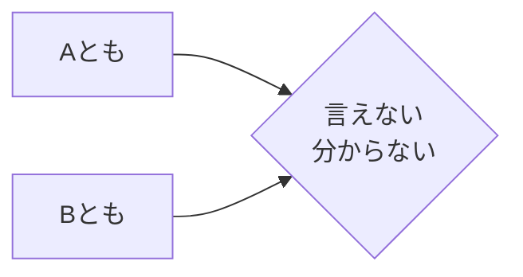

Processing keyword: A とも B とも (A tomo B tomo)
# Japanese Grammar Point: A とも B とも (A tomo B tomo)

## 1. Introduction
In Japanese, expressing uncertainty or ambiguity is often necessary, especially when you cannot clearly define or categorize something. The grammar point **AともBとも** is used to convey that something cannot be definitively labeled as A or B. This structure is particularly useful for expressing nuanced opinions or observations.

---
## 2. Core Grammar Explanation
### Meaning
**AともBとも** translates to "**Neither A nor B**" or "**Cannot say whether A or B**". It is used when the speaker cannot definitively state that something is A or B, highlighting uncertainty or indecisiveness.
### Structure
The basic formation of this grammar point is:
```
[A] とも [B] とも + 言えない／分からない／決められない／判断できない
```
- **A** and **B** are usually adjectives, verbs in plain form, or nouns.
- Often followed by verbs like **言えない** (cannot say), **分からない** (don't know), or **判断できない** (cannot judge).
### Formation Diagram
| **Component**               |                **Explanation**                |
| --------------------------- | :-------------------------------------------: |
| Aとも                       |    "even A" (implying not definitively A)     |
| Bとも                       |    "even B" (implying not definitively B)     |
| 言えない／分からない etc.    | Expression of inability to decide or define |
### Visual Aid

---
## 3. Comparative Analysis
### Similar Grammar Points
- **AでもBでもない**: Directly means "not A nor B". Used to state that something is neither A nor B.
  - *Example*: 彼は学生でも先生でもない。 (He is neither a student nor a teacher.)
**Comparison**:
- **AともBとも言えない** implies uncertainty or inability to classify, while **AでもBでもない** definitively states that something is neither A nor B.
---
## 4. Examples in Context
### Example 1
**Sentence**:
- 彼の表情は嬉しいとも悲しいとも判断できない。
**Reading**:
- かれの ひょうじょう は うれしい とも かなしい とも はんだん できない。
**Translation**:
- "I cannot determine whether his expression is happy or sad."
### Example 2
**Sentence**:
- その映画は面白いともつまらないとも言えない。
**Reading**:
- その えいが は おもしろい とも つまらない とも いえない。
**Translation**:
- "I can't say whether the movie is interesting or boring."
### Example 3
**Sentence**:
- この料理は美味しいとも美味しくないとも言えない味だ。
**Reading**:
- この りょうり は おいしい とも おいしくない とも いえない あじ だ。
**Translation**:
- "This dish has a taste that I can't say is delicious or not."
### Example 4 (Formal Context)
**Sentence**:
- 結果は成功とも失敗とも申せません。
**Reading**:
- けっか は せいこう とも しっぱい とも もうせません。
**Translation**:
- "I cannot say whether the results are a success or a failure."
---
## 5. Cultural Notes
### Cultural Relevance
In Japanese communication, expressing uncertainty or avoiding direct statements is common, especially to maintain harmony and avoid conflict. The use of **AともBとも** allows the speaker to convey ambiguity politely.
### Levels of Politeness
- The verbs following **AともBとも** can be adjusted for politeness:
  - Casual: 言えない (can't say)
  - Polite: 言えません (can't say)
  - Humble/Formal: 申せません (cannot say - humble form)
---
## 6. Common Mistakes and Tips
### Error Analysis
- **Mistake**: Using **AともBとも** with only one option.
  - *Incorrect*: 彼は行くとも言えない。
  - *Correct*: 彼は行くとも行かないとも言えない。
- **Mistake**: Forgetting to include the verb expressing uncertainty.
  - *Incorrect*: 天気は晴れとも雨とも。
  - *Correct*: 天気は晴れとも雨とも分からない。
### Learning Strategies
- **Mnemonic Device**: Remember that **とも** repeats after both A and B to emphasize the uncertainty about both options.
- **Tip**: Pair **AともBとも** with verbs like **言えない**, **判断できない**, **分からない** to complete the expression.
---
## 7. Summary and Review
### Key Takeaways
- **AともBとも** is used to express that something cannot be clearly defined as A or B.
- It emphasizes uncertainty or the inability to make a definitive judgment.
- Commonly followed by verbs expressing inability to decide, such as **言えない** or **分からない**.
- Reflects the Japanese communication style of expressing ambiguity politely.
### Quick Recap Quiz
1. **Fill in the blank**: その答えは正しいとも間違っているとも ______。
   - **Answer**: 言えない
2. **True or False**: The structure **AともBとも** can be used to definitively state that something is neither A nor B.
   - **Answer**: False (It expresses uncertainty, not a definitive statement.)
3. **Choose the correct verb**: 天気が良いとも悪いとも ______。
   - a) 思う
   - b) 分からない
   - c) 決めた
   - **Answer**: b) 分からない
---
Feel free to revisit the examples and explanations to reinforce your understanding of **AともBとも**. Practice by creating your own sentences using this grammar point!


---

© [Hanabira.org](https://hanabira.org)
