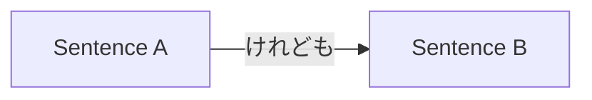

Processing keyword: A。けれども、～B。(A. Keredomo,~ B.)
# Japanese Grammar Point: A。けれども、～B。(A. Keredomo,~ B.)


---
## 1. Introduction
In this lesson, we'll explore the Japanese grammar point **A。けれども、～B。**, which is used to connect two statements where the second contrasts with or provides an exception to the first. Understanding how to use **けれども** will enhance your ability to express contrasting ideas, much like "however" or "but" in English.

---
## 2. Core Grammar Explanation
### Meaning
**けれども** is a conjunction that means **"but"**, **"however"**, or **"though"**. It is used to link two sentences where the second sentence presents a contrast, contradiction, or unexpected result in relation to the first sentence.
### Structure
The structure for using **けれども** in this pattern is as follows:
```
A。けれども、B。
```
- **A**: A complete sentence ending with plain form.
- **けれども**: Conjunction meaning "however" or "but".
- **B**: The contrasting statement.
### Formation Diagram
| **Form**       | **Example**                           |
|----------------|---------------------------------------|
| **Sentence A** | 明日は雨が降るらしい。                 |
| **けれども**   | けれども、                              |
| **Sentence B** | 試合は中止にならない。                 |
| **Full Sentence** | 明日は雨が降るらしい。けれども、試合は中止にならない。 |
### Detailed Explanation
- **Sentence A** ends with a plain form (can be present or past tense).
- **けれども** can be used at the beginning of a new sentence to show contrast.
- **Sentence B** presents a situation that contrasts with what would be expected from Sentence A.
### Visual Aid: Flow Diagram

---
## 3. Comparative Analysis
**けれども** vs. other contrasting conjunctions:
| **Conjunction** | **Usage**                       | **Politeness Level** |
|-----------------|---------------------------------|----------------------|
| けれども         | Conversational, written         | Neutral              |
| が               | Formal writing, polite speech   | Polite               |
| でも             | Conversational, at start of B   | Casual               |
| しかし           | Formal, written                | Formal               |
| だけど           | Casual speech                   | Casual               |
**Example Comparison:**
- **けれども**: 雨が降っています。けれども、出かけます。
- **が**: 雨が降っていますが、出かけます。
- **でも**: 雨が降っています。でも、出かけます。
- **しかし**: 雨が降っています。しかし、出かけます。
- **だけど**: 雨が降っています。だけど、出かけます。
---
## 4. Examples in Context
### Example 1: Formal Context
**Japanese:** 新しいパソコンを買いました。けれども、使い方がよく分かりません。
**Romaji:** Atarashii pasokon o kaimashita. Keredomo, tsukaikata ga yoku wakarimasen.
**Translation:** I bought a new computer. However, I don't quite understand how to use it.

---
### Example 2: Informal Speech
**Japanese:** 昨日勉強した。けれども、テストに合格できなかった。
**Romaji:** Kinō benkyō shita. Keredomo, tesuto ni gōkaku dekinakatta.
**Translation:** I studied yesterday. But I couldn't pass the test.

---
### Example 3: Expressing Unexpected Result
**Japanese:** この道は近い。けれども、危険だ。
**Romaji:** Kono michi wa chikai. Keredomo, kiken da.
**Translation:** This road is short. However, it's dangerous.

---
### Example 4: Written Communication
**Japanese:** 提案を送りました。けれども、ご返事をいただいておりません。
**Romaji:** Teian o okurimashita. Keredomo, gohenji o itadaite orimasen.
**Translation:** I sent the proposal. However, I haven't received a reply.

---
## 5. Cultural Notes
### Levels of Politeness
- **けれども** is considered neutral and can be used in both formal and informal contexts.
- In very formal writing or speeches, **しかし** or **が** might be preferred.
- In casual conversations, shorter forms like **けど** or **だけど** are commonly used.
### Idiomatic Expressions
- **とはいえけれども**: Means "Having said that, however..." Used to acknowledge a point but introduce a contrast.

---
## 6. Common Mistakes and Tips
### Common Mistake 1: Using the Wrong Conjunction
- **Error:** Using **けれども** in very formal writing where **しかし** is more appropriate.
- **Tip:** Remember that **けれども** is neutral; for formal writing, consider using **しかし**.
### Common Mistake 2: Incorrect Placement
- **Error:** Placing **けれども** at the end of Sentence A without a period.
  - **Incorrect:** 新しい靴を買ったけれども、サイズが合わない。
  - (This is correct in spoken Japanese but not following the **A。けれども、B。** pattern.)
- **Tip:** Ensure Sentence A ends with a period when using this pattern.
### Learning Strategy
- **Mnemonic Device:** Think of **けれども** as a bridge between two contrasting islands (sentences). The period after A signifies the end of one island before crossing the bridge to the next.
---
## 7. Summary and Review
### Key Takeaways
- **けれども** means "but" or "however" and connects two contrasting sentences.
- The structure is **A。けれども、B。**, with a period after Sentence A.
- It is neutral in politeness and suitable for both formal and informal contexts.
- Be mindful of choosing the appropriate conjunction based on formality.
### Quick Recap Quiz
1. What does **けれども** mean in English?
   - **Answer:** "But", "however", or "though".
2. Is **けれども** considered formal or casual?
   - **Answer:** Neutral; suitable for both formal and informal contexts.
3. Translate the following sentence:
   - **Japanese:** 天気は悪い。けれども、試合は行われる。
   - **Answer:** The weather is bad. However, the game will be held.
---
By mastering **A。けれども、～B。**, you'll be able to express contrasting ideas more naturally in Japanese and enhance your overall fluency.


---

© [Hanabira.org](https://hanabira.org)
