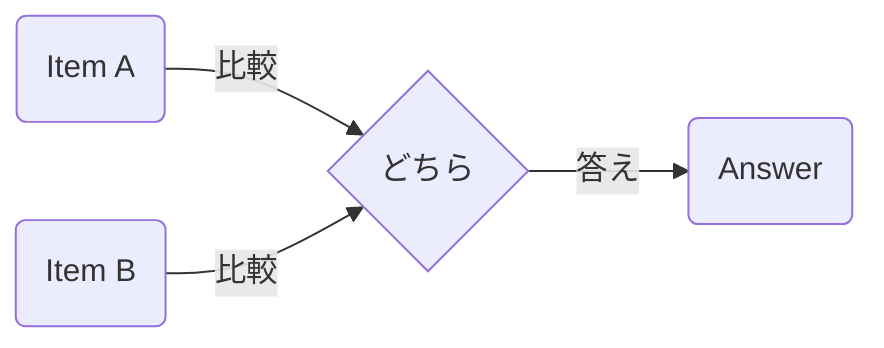

Processing keyword: Aと Bと どちら～ (A to B to dochira~)
# Japanese Grammar Point: Aと Bと どちら～ (A to B to dochira~)

## 1. Introduction
The grammar pattern **Aと Bと どちら〜** is commonly used in Japanese to ask for a preference or to compare two items. It translates to "Which is more ~, A or B?" and is essential for everyday conversations, especially when making choices or seeking opinions.

---
## 2. Core Grammar Explanation
### Meaning
**Aと Bと どちら〜** is used to compare two things, people, or actions, and ask which one fits a certain description more. It helps in eliciting preferences or comparisons.
### Structure
The basic structure of this grammar pattern is:
```
A と B と どちら + adjective/verb ですか？
```
- **A** and **B**: Items being compared.
- **どちら**: "Which one" or "which".
- **adjective/verb**: Describes the quality or action being compared.
### Formation Diagram
| A       | と  | B       | と  | どちら | ～ですか？ |
|---------|-----|---------|-----|--------|------------|
| Item A  | and | Item B  | and | Which  | ～?         |
### Visual Aid
Here's a visual representation:

---
## 3. Comparative Analysis
This pattern is similar to using **より (yori)** for comparisons but specifically asks for a choice between two options.
- **AはBより～です。**: "A is more ~ than B."
- **AとBとどちらが～ですか。**: "Between A and B, which is more ~?"
---
## 4. Examples in Context
### Sentence Examples
1. **家と車とどちらが高いですか。**
   *Ie to kuruma to dochira ga takai desu ka.*
   "Which is more expensive, a house or a car?"
2. **コーヒーと紅茶とどちらを飲みますか。**
   *Kōhī to kōcha to dochira o nomimasu ka.*
   "Which do you drink, coffee or tea?"
3. **犬と猫とどちらが好きですか。**
   *Inu to neko to dochira ga suki desu ka.*
   "Which do you like more, dogs or cats?"
4. **日本語と中国語とどちらのほうが難しいですか。**
   *Nihongo to chūgokugo to dochira no hō ga muzukashii desu ka.*
   "Which is more difficult, Japanese or Chinese?"
5. **夏と冬とどちらがいいですか。**
   *Natsu to fuyu to dochira ga ii desu ka.*
   "Which do you prefer, summer or winter?"
---
## 5. Cultural Notes
### Cultural Relevance
In Japanese culture, indirectness and politeness are valued. Using **Aと Bと どちら〜** allows the speaker to politely inquire about someone's preference without sounding too direct.
### Idiomatic Expressions
- **どちらも好きです。**
  *Dochira mo suki desu.*
  "I like both."
- **どちらでもいいです。**
  *Dochira demo ii desu.*
  "Either is fine."
---
## 6. Common Mistakes and Tips
### Error Analysis
- **Omitting the second と (to):**
  Incorrect: **Aと B どちらが～**
  Correct: **Aと Bと どちらが～**
- **Confusion with より (yori):**
  Remember that **どちら** is used for asking, while **より** is used for stating comparisons.
### Learning Strategies
- **Mnemonic Device:**
  Think of **と** as "and" connecting the two options, and **どちら** as "which," prompting a choice.
- **Practice Makes Perfect:**
  Create your own sentences comparing things you encounter daily.
---
## 7. Summary and Review
### Key Takeaways
- **Aと Bと どちら〜** is used to ask for a preference or comparison between two items.
- Always include both **と** particles after A and B.
- It's a polite way to inquire about someone's opinion or choice.
### Quick Recap Quiz
1. How do you ask "Which is faster, a car or a bicycle?" in Japanese?
2. Fill in the blanks: **リンゴ＿バナナ＿どちらが甘いですか。**
3. What is the response if you like both options equally?
---
**Answers:**
1. **車と自転車とどちらが速いですか。**
   *Kuruma to jitensha to dochira ga hayai desu ka.*
2. リンゴ**と**バナナ**と**どちらが甘いですか。
   *Ringo to banana to dochira ga amai desu ka.*
3. **どちらも好きです。**
   *Dochira mo suki desu.*


---

© [Hanabira.org](https://hanabira.org)
