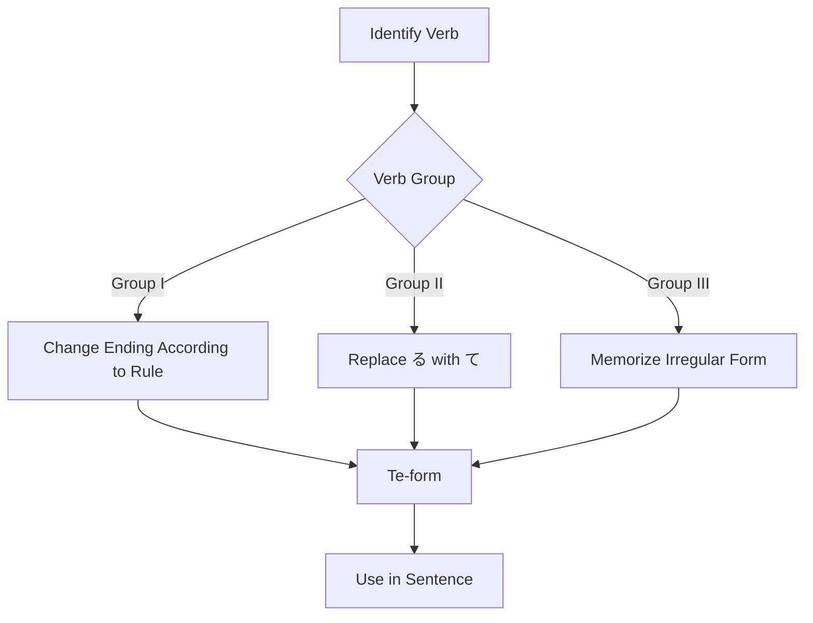

Processing keyword: Verb て～ (Verb + te～)
# Japanese Grammar Point: Verb て～ (Verb + te～)

## 1. Introduction
The **て-form** of verbs, known as the **"te-form"**, is one of the most essential and versatile conjugations in Japanese grammar. Mastery of the te-form opens the door to constructing more complex sentences, expressing continuous actions, making requests, and connecting ideas smoothly. Understanding and using the te-form is crucial for anyone aiming to achieve fluency in Japanese.

---
## 2. Core Grammar Explanation
### Meaning and Usage
The te-form is used to:
- **Connect sequential actions** (e.g., "do A and then do B")
- **Form the present progressive tense** (e.g., "am doing")
- **Make polite requests** (e.g., "please do")
- **Grant or ask for permission** (e.g., "may I do")
- **Express prohibition** (e.g., "must not do")
- **Provide reasons or causes** (e.g., "because I did")
### Formation of the Te-form
Japanese verbs are categorized into three groups, and the formation of the te-form differs for each group.
#### Verb Groups
1. **Group I (Godan verbs)**: Verbs ending with a consonant sound before **う** (_-u verbs_)
2. **Group II (Ichidan verbs)**: Verbs ending with a vowel sound before **る** (_-iru and -eru verbs_)
3. **Group III (Irregular verbs)**: **する** (_suru_) and **くる** (_kuru_)
---
### Formation Rules
#### **Group I (Godan Verbs)**
For Group I verbs, the ending changes based on the consonant before **う**.
| **Ending** | **Te-form Change** | **Example Verb** | **Te-form** |
|------------|--------------------|------------------|-------------|
| **う**, **つ**, **る** | って               | 会う (_au_, meet)        | 会って       |
| **ぶ**, **む**, **ぬ** | んで               | 飲む (_nomu_, drink)     | 飲んで       |
| **く**          | いて               | 書く (_kaku_, write)     | 書いて       |
| **ぐ**          | いで               | 泳ぐ (_oyogu_, swim)     | 泳いで       |
| **す**          | して               | 話す (_hanasu_, speak)   | 話して       |
#### **Group II (Ichidan Verbs)**
For Group II verbs, simply replace **る** with **て**.
| **Example Verb**     | **Te-form** |
|----------------------|-------------|
| 食べる (_taberu_, eat) | 食べて       |
| 見る (_miru_, see)     | 見て         |
#### **Group III (Irregular Verbs)**
Memorize the te-forms of these verbs.
| **Verb**          | **Te-form** |
|-------------------|-------------|
| する (_suru_, do) | して         |
| くる (_kuru_, come)| きて         |
---
### Visual Aid: Verb Conjugation Flowchart

---
## 3. Comparative Analysis
### Te-form vs. Masu-form
- **Masu-form** is used to make verbs polite and is suitable for formal situations.
  - Example: 食べます (_tabemasu_, "eat" politely)
- **Te-form** is not used by itself to complete a sentence but is used to connect verbs, make requests, or form compound sentences.
  - Example: 食べて (_tabete_, "eat and...")
**Key Difference**: Masu-form ends the action politely, while te-form connects actions or adds functions to the verb.
---
## 4. Examples in Context
### 1. Connecting Actions
**彼は朝起きて、ジョギングをします。**
*かれは あさ おきて、ジョギングを します。*
"He wakes up in the morning and jogs."
### 2. Present Progressive Tense
**彼女は今、音楽を聴いています。**
*かのじょは いま、おんがくを きいています。*
"She is listening to music right now."
### 3. Making Polite Requests
**窓を閉めてください。**
*まどを しめてください。*
"Please close the window."
### 4. Granting Permission
**ここで写真を撮ってもいいですか。**
*ここで しゃしんを とってもいいですか。*
"May I take pictures here?"
### 5. Expressing Prohibition
**携帯電話を使ってはいけません。**
*けいたいでんわを つかってはいけません。*
"You must not use your mobile phone."
### 6. Expressing Reason or Cause
**雨が降って、試合が延期になりました。**
*あめが ふって、しあいが えんきに なりました。*
"It rained, so the game was postponed."
### 7. Informal Conversations
**友達と映画を見て、晩ごはんを食べた。**
*ともだちと えいがを みて、ばんごはんを たべた。*
"I watched a movie with friends and ate dinner."

---
## 5. Cultural Notes
### Politeness and Formality
- The te-form combined with **ください** makes a polite request.
  - Example: 手伝ってください。(_Tetsudatte kudasai._) "Please help me."
- Omitting **ください** makes it casual, suitable among close friends.
  - Example: 手伝って。(_Tetsudatte._) "Help me."
### Idiomatic Expressions Using Te-form
- **～ている**: Indicates an ongoing action or a state resulting from an action.
  - 住んでいる (_sunde iru_): "is living"
- **～てしまう**: Conveys completion or regret.
  - 食べてしまった (_tabete shimatta_): "I have eaten (it all)" or "I accidentally ate (it)."
---
## 6. Common Mistakes and Tips
### Common Mistakes
1. **Incorrect Verb Group Identification**
   Misidentifying a verb's group can lead to incorrect conjugation.
   - Mistake: **起きる (okiru)** -> **起きって** ❌
   - Correction: **起きる** is a Group II verb, so it becomes **起きて** ✅
2. **Overlooking Irregular Verbs**
   Forgetting that **する** and **くる** are irregular.
   - Mistake: **する** -> **すて** ❌
   - Correction: **する** -> **して** ✅
### Tips for Learning
- **Mnemonic for Group I Verbs Ending with う, つ, る**
  - Remember "**Utsuru -> Tte**"
  - Verbs ending with **う**, **つ**, **る** change to **って**
- **For Verbs Ending with む, ぶ, ぬ**
  - Remember "**MuBuNu -> Nde**"
  - They change to **んで**
- **Practice Verb Grouping**
  - Regularly practice categorizing verbs into their correct groups.
---
## 7. Summary and Review
### Key Takeaways
- The **te-form** is crucial for connecting verbs and forming various grammatical structures.
- Proper formation depends on correctly identifying the verb group.
- The te-form is used in many expressions and is essential for everyday communication.
### Quick Recap Quiz
1. **Convert the verb 読む (_yomu_, "to read") to its te-form.**
   **Answer:** 読んで (_yonde_)
2. **How do you say "Please speak slowly" using the te-form?**
   **Answer:** ゆっくり話してください。(_Yukkuri hanashite kudasai._)
3. **What is the te-form of 行く (_iku_, "to go")?**
   **Answer:** 行って (_itte_)
---
*Keep practicing the te-form in different contexts to enhance your understanding and fluency!*

---

© [Hanabira.org](https://hanabira.org)
