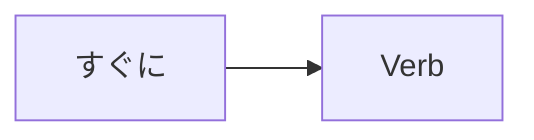

Processing keyword: すぐに～ (sugu ni～)
# Japanese Grammar Point: すぐに～ (sugu ni～)

## 1. Introduction
The Japanese adverb **すぐに (sugu ni)** is commonly used to express the idea of "immediately," "right away," or "soon." It's an essential term for indicating promptness or immediacy in actions and events. Understanding how to use **すぐに** correctly will enhance your ability to describe time-related nuances in Japanese conversation.

---
## 2. Core Grammar Explanation
### Meaning
- **すぐに**: immediately; right away; soon
### Structure
The adverb **すぐに** is placed before a verb to indicate that the action will happen without delay.
```
すぐに + Verb
```
### Formation Diagram

---
## 3. Comparative Analysis
**すぐに** vs. **もうすぐ**
- **すぐに**: Indicates an action that will happen immediately.
  - Example: すぐに始めます。(I will start immediately.)
- **もうすぐ**: Means "soon" or "in a little while," implying a short time before something happens.
  - Example: もうすぐ夏休みです。(Summer vacation is soon.)
---
## 4. Examples in Context
### Formal Situations
1. **会議をすぐに始めます。**
   - *Kaigi o sugu ni hajimemasu.*
   - "We will start the meeting immediately."
2. **申し込みはすぐに締め切られます。**
   - *Mōshikomi wa sugu ni shimekira remasu.*
   - "Applications will close immediately."
### Informal Situations
1. **すぐに戻ってくるよ。**
   - *Sugu ni modotte kuru yo.*
   - "I'll be back right away."
2. **すぐに行かなきゃ。**
   - *Sugu ni ikanakya.*
   - "I have to go immediately."
### Written Context
1. **注文後、商品はすぐに発送されます。**
   - *Chūmon go, shōhin wa sugu ni hassō saremasu.*
   - "After ordering, the product will be shipped immediately."
### Spoken Context
1. **店員：ご注文はお決まりですか。**
   - *Ten'in: Go-chūmon wa okimari desu ka.*
   - "Waiter: Have you decided on your order?"
2. **客：はい、すぐにお願いします。**
   - *Kyaku: Hai, sugu ni onegaishimasu.*
   - "Customer: Yes, right away, please."
---
## 5. Cultural Notes
### Cultural Relevance
In Japanese culture, punctuality and promptness are highly valued. Using **すぐに** reflects a respect for others' time and conveys a sense of urgency or attentiveness. It can be particularly important in business settings or when showing courtesy.

---
## 6. Common Mistakes and Tips
### Error Analysis
- **Mistake**: Placing **すぐに** after the verb.
  - Incorrect: **帰りますすぐに。**
    - *Kairimasu sugu ni.*
  - Correct: **すぐに帰ります。**
    - *Sugu ni kaerimasu.*
- **Mistake**: Confusing **すぐに** with **すこし (sukoshi)** which means "a little."
  - Be careful not to mix these up due to similar sounds.
### Learning Strategies
- **Mnemonic Device**: Think of **すぐに** as "soon ni," reminding you that it means "soon" or "immediately."
- **Practice Tip**: Use **すぐに** in daily reminders. For example, "すぐに勉強する！" (*Study immediately!*)
---
## 7. Summary and Review
### Key Takeaways
- **すぐに** means "immediately" or "right away."
- It is placed **before the verb** to indicate prompt action.
- Do not confuse **すぐに** with **もうすぐ** or **すこし**.
- Proper use of **すぐに** reflects attentiveness and respect for time in Japanese culture.
### Quick Recap Quiz
1. How do you say "I'll call you immediately" in Japanese?
   - **Answer**: すぐに電話します。(*Sugu ni denwa shimasu.*)
2. Which is correct?
   - a) 帰りますすぐに。
   - b) すぐに帰ります。
   - **Answer**: b) すぐに帰ります。
3. What does **もうすぐ** mean?
   - **Answer**: "Soon" or "in a little while," but not immediately.
---
By mastering **すぐに**, you enhance your ability to express urgency and immediacy in Japanese, making your communication more precise and culturally appropriate.


---

© [Hanabira.org](https://hanabira.org)
