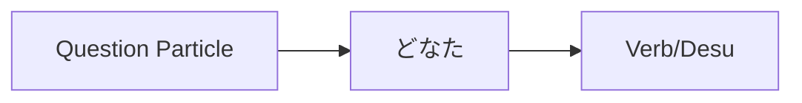

Processing keyword: どなた～ (donata～)
# Japanese Grammar Point: どなた～ (donata～)

## 1. Introduction
In this lesson, we'll explore the usage of **どなた** (donata), a polite interrogative pronoun in Japanese. Understanding how to use **どなた** appropriately is essential for respectful communication, especially in formal settings.

---
## 2. Core Grammar Explanation
### Meaning
**どなた** (donata) means **"who"** in English. It is the polite or honorific form of **誰** (dare), which also means "who".
### Structure
The word **どなた** is used in questions to ask about a person's identity in a polite manner.
#### Formation Diagram

- **どなたですか？**  
  "Who are you?" (Polite)
### Usage Notes
- **どなた** is often used in formal situations, such as business meetings, customer service, or when speaking to someone of higher social status.
- It is considered more respectful than **誰** (dare).
---
## 3. Comparative Analysis
| Japanese      | Reading | Politeness Level | Usage                         |
| ------------- | ------- | ---------------- | ----------------------------- |
| 誰            | dare    | Casual           | Used among friends, peers     |
| どなた        | donata  | Polite/Formal    | Used in formal settings       |
| どちら様      | dochira-sama | Very Polite/Honorific | Extremely polite, used in very formal contexts |
---
## 4. Examples in Context
### Example Sentences
1. **こちらはどなたですか。**  
   *Kochira wa donata desu ka.*  
   "Who is this person?" (Polite inquiry)
2. **お電話をくださったのはどなたでしょうか。**  
   *O-denwa o kudasatta no wa donata deshou ka.*  
   "Who might be the one who called?" (Polite, honorific)
3. **会場にはどなたがいらっしゃいますか。**  
   *Kaijou ni wa donata ga irasshaimasu ka.*  
   "Who is present at the venue?" (Polite, using honorific verb)
4. **どなたにお会いしたいですか。**  
   *Donata ni o-ai shitai desu ka.*  
   "Who would you like to meet?" (Polite)
### Contextual Usage
- **Formal Setting (Business):**  
  **どなたがプロジェクトの責任者ですか。**  
  *Donata ga purojekuto no sekininsha desu ka.*  
  "Who is the person in charge of the project?"
- **Customer Service:**  
  **ご予約はどなたの名前でされていますか。**  
  *Goyoyaku wa donata no namae de sarete imasu ka.*  
  "Under whose name is the reservation made?"
---
## 5. Cultural Notes
### Cultural Relevance
Using **どなた** reflects the Japanese cultural emphasis on respect and social hierarchy. It is important to use the appropriate level of politeness to show respect, especially in the following situations:
- Speaking to customers or clients
- Addressing elders or superiors
- Formal occasions and introductions
### Idiomatic Expressions
- **どなた様でしょうか。**  
  *Donata-sama deshou ka.*  
  An extremely polite way to ask "Who is this?", often used when answering the phone or door.
---
## 6. Common Mistakes and Tips
### Error Analysis
- **Using 誰 (dare) instead of どなた (donata) in formal situations:**  
  This can come across as rude or too casual.
  - Incorrect: **あなたは誰ですか。** (*Anata wa dare desu ka.*)
  - Correct: **どなたですか。** (*Donata desu ka.*)
### Learning Strategies
- **Mnemonic Device:**  
  Think of **どなた** as "Don (Mr.) + ata (person)" to remember it's a polite form when asking about someone.
- **Practice Politeness Levels:**  
  Pair **どなた** with honorific verbs for added politeness. For example, using **いらっしゃいます** instead of **います**.
---
## 7. Summary and Review
### Key Takeaways
- **どなた** is the polite form of **誰** (who).
- Use **どなた** in formal situations to show respect.
- Remember to adjust the level of politeness based on the context and the person you're addressing.
### Quick Recap Quiz
1. How do you ask "Who is this?" politely in Japanese?
   a) **これは誰ですか。**  
   b) **こちらはどなたですか。**  
   c) **これは何ですか。**
2. Which is more polite: **誰** or **どなた**?
3. Fill in the blank with the appropriate word: **ご担当者は ______ でしょうか。**  
   (*Who is the person in charge?*)
---
**Answers:**
1. b) **こちらはどなたですか。**
2. **どなた** is more polite than **誰**.
3. **どなた** — **ご担当者はどなたでしょうか。**

---

© [Hanabira.org](https://hanabira.org)
