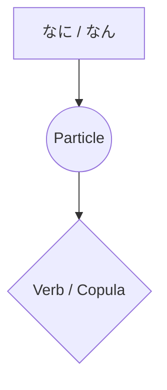

Processing keyword: なに～ (nani~)
# Japanese Grammar Point: なに～ (nani~)

## 1. Introduction
The word **なに** (nani) is a fundamental interrogative pronoun in Japanese, translating to **"what"** in English. It is used to ask questions about things, actions, and descriptions. Understanding how to use **なに** correctly is essential for effective communication in Japanese.

---
## 2. Core Grammar Explanation
### Meaning and Usage
- **なに (nani)**: Means **"what"** and is used to inquire about objects, actions, or explanations.
- It can be combined with particles to form questions or expressions.
### Structure and Formation
#### Basic Question Structure
```markdown
[Question Word] + [Particle] + [Verb] + か？
```
- **なにをしますか？**
  - _Nani o shimasu ka?_
  - "What will (you) do?"
#### Combining with Particles
| Particle | Usage                        | Example                         | Translation                 |
|----------|------------------------------|---------------------------------|-----------------------------|
| **が**   | Marks the subject            | なにが必要ですか？              | What is necessary?          |
| **を**   | Marks the direct object      | なにを食べますか？              | What will (you) eat?        |
| **に**   | Indicates direction or time  | なににしますか？                | What will you have/choose?  |
| **で**   | Indicates means or location  | なにで行きますか？              | By what means will you go?  |
| **も**   | Means "anything/nothing"     | なにもいりません。              | I don't need anything.      |
| **か**   | Means "something/anything"   | なにかありますか？              | Is there something?         |
### Difference Between なに and なん
Both **なに** and **なん** mean "what," but their usage depends on the context and the words that follow:
- **なに** is used before particles and in standalone form.
  - **なにをしますか？** (_What will you do?_)
- **なん** is used before words starting with **d**, **t**, **n**, and counters.
  - **なんですか？** (_What is it?_)
  - **なんにんいますか？** (_How many people are there?_)
  
### Formation Diagram

---
## 3. Comparative Analysis
### なに vs. なん
- Use **なに**:
  - Before particles (**が, を, に, で, も**)
    - **なにを食べますか？** (_What will you eat?_)
- Use **なん**:
  - Before **です**
    - **なんですか？** (_What is it?_)
  - Before words starting with **d**, **t**, **n**
    - **なんで行きますか？** (_How will you go?_)
  - Before counters
    - **なんにんいますか？** (_How many people are there?_)
### Comparison with Other Interrogatives
| Japanese | Reading   | Meaning    |
|----------|-----------|------------|
| どれ     | dore      | Which one  |
| どの     | dono      | Which ~    |
| だれ     | dare      | Who        |
| いつ     | itsu      | When       |
| どこ     | doko      | Where      |
| **なに** | **nani**  | **What**   |
---
## 4. Examples in Context
### Formal Speech
1. **お名前はなんですか？**
   - _O-namae wa nan desu ka?_
   - "What is your name?"
2. **これはなにがありますか？**
   - _Kore wa nani ga arimasu ka?_
   - "What is there here?"
### Informal Speech
1. **なに食べる？**
   - _Nani taberu?_
   - "What are you going to eat?"
2. **週末になにするの？**
   - _Shūmatsu ni nani suru no?_
   - "What are you doing on the weekend?"
### Written Context
1. **この言葉の意味はなんですか。**
   - _Kono kotoba no imi wa nan desu ka._
   - "What is the meaning of this word?"
2. **なにを求めていますか。**
   - _Nani o motomete imasu ka._
   - "What are you seeking?"
### Spoken Context
1. **えっ、なんだって？**
   - _Eh, nan datte?_
   - "Huh, what did you say?"
2. **なにが起こったの？**
   - _Nani ga okotta no?_
   - "What happened?"
---
## 5. Cultural Notes
### Levels of Politeness
- Using **なんですか** is more casual and can sometimes sound abrupt.
  - To be more polite, use **なんでしょうか** or add **お** prefix: **おなまえは？**
### Idiomatic Expressions
1. **なになに**
   - Used to indicate interest or prompt someone to continue.
     - **なになに、もっと教えて。**
       - _Nani nani, motto oshiete._
       - "What, what? Tell me more."
2. **なになにかんになになに**
   - A placeholder for unspecified items, similar to "such and such."
     - **彼はなになに会社の社長だ。**
       - _Kare wa naninani kaisha no shachō da._
       - "He is the president of such-and-such company."
---
## 6. Common Mistakes and Tips
### Common Mistakes
- **Using "nani" and "nan" interchangeably without considering the following word.**
  - Incorrect: **なにですか？**
  - Correct: **なんですか？**
- **Forgetting particles after "nani."**
  - Incorrect: **なに食べますか？**
  - Correct: **なにを食べますか？**
### Tips
- **Remember the "D/T/N Rule":** Use **なん** before words starting with **d**, **t**, **n**, or counters.
- **Use Particles Properly:** Always include the appropriate particle after **なに** to clarify the grammatical role.
---
## 7. Summary and Review
### Key Takeaways
- **なに** means "what" and is essential for asking questions.
- Use **なに** or **なん** depending on the following word.
- Combine **なに** with particles to form specific questions.
- Be mindful of politeness levels when using **なに** in conversation.
### Quick Recap Quiz
1. Fill in the blank: **______で行きますか？** (_By what means will you go?_)
   - **Answer:** なんで
2. Is this sentence correct? **なにですか？**
   - **Answer:** No, it should be **なんですか？**
3. How do you say "What will you drink?" in Japanese?
   - **Answer:** **なにを飲みますか？**
---
By mastering **なに**, you'll be able to ask a variety of questions and enhance your communication in Japanese. Remember to pay attention to the context and the rules for using **なに** and **なん**.


---

© [Hanabira.org](https://hanabira.org)
