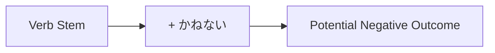

Processing keyword: ～かねない (〜kane nai)
# Japanese Grammar Point: ～かねない (〜kane nai)

## 1. Introduction
In this lesson, we'll explore the Japanese grammar point **～かねない (〜kane nai)**. This expression is used to indicate that there is a possibility of something negative or undesirable occurring. Understanding how to use **～かねない** will help you express potential negative outcomes or concerns in various contexts.

---
## 2. Core Grammar Explanation
### Meaning
**～かねない** translates to "**might (result in)**", "**could happen**", or "**there is a possibility that**" something negative may occur. It is used to warn or express concern about a potential undesirable outcome.
### Structure
The structure for using **～かねない** is:
```
Verb Stem + かねない
```
### Formation Diagram
| Verb Form     | + かねない | Resulting Form        |
|---------------|-----------|-----------------------|
| 読み (from 読む) | かねない    | 読みかねない           |
| 起こし (from 起こす) | かねない    | 起こしかねない         |
| なり (from なる) | かねない    | なりかねない           |
### Detailed Explanation
- **Verb Stem**: The verb stem is obtained by removing the **-ます** from the **-ます** form of the verb.
  - Example: **食べます** → **食べ** (stem)
- **～かねない** attaches directly to the verb stem.
- The expression is used to indicate a potential negative outcome that is considered possible under the circumstances.
### Visual Aid: Usage Flowchart

---
## 3. Comparative Analysis
### ～かねる vs. ～かねない
- **～かねる**: Means "**cannot do**" or "**hard to do**", expressing inability or reluctance.
  - Example: ご期待には応じかねます。 (I cannot comply with your request.)
- **～かねない**: Means "**might happen**", especially a negative event.
  - Example: 彼は秘密を漏らしかねない。 (He might leak the secret.)
**Difference**: While **～かねる** expresses an inability or refusal, **～かねない** expresses a possibility of something (usually negative) happening.
---
## 4. Examples in Context
### Example Sentences
1. **彼の言い方は誤解を招きかねない。**
   - *Kare no iikata wa gokai o maneki kane nai.*
   - *His way of speaking might cause misunderstandings.*
2. **そんな無責任な態度では、問題が起こりかねない。**
   - *Sonna musekinin na taido de wa, mondai ga okori kane nai.*
   - *With such an irresponsible attitude, problems might arise.*
3. **このまま雨が降り続けば、川が氾濫しかねない。**
   - *Kono mama ame ga furitsudzukeba, kawa ga hanran shi kane nai.*
   - *If the rain continues like this, the river might flood.*
4. **あまりお酒を飲むと健康を害しかねない。**
   - *Amari osake o nomu to kenkō o gaishi kane nai.*
   - *Drinking too much alcohol might harm your health.*
5. **彼女は怒りを抑えきれず、言い過ぎてしまいかねない。**
   - *Kanojo wa ikari o osae kirezu, iisugite shimai kane nai.*
   - *Unable to suppress her anger, she might end up saying too much.*
---
## 5. Cultural Notes
### Levels of Politeness and Formality
- **～かねない** is a neutral expression and can be used in both formal and informal contexts.
- Often used in written language, news reports, or formal statements to warn about potential risks.
### Idiomatic Expressions
- **死にかねない**: Might die.
  - Used to emphasize the seriousness of a situation.
- **忘れかねない**: Might forget.
  - Used to express concern over forgetting something important.
---
## 6. Common Mistakes and Tips
### Error Analysis
- **Mistake**: Using the plain dictionary form of the verb instead of the verb stem.
  - Incorrect: *食べるかねない*
  - Correct: *食べかねない*
- **Mistake**: Confusing **～かねない** with **～かもしれない** (might, may).
  - While both express possibility, **～かねない** often implies a negative outcome and is more certain.
### Learning Strategies
- **Mnemonic Device**: Think of **～かねない** as "can't help but (negative consequence)".
- **Association**: Associate **かねない** with "金" (money) and think "If I spend too much, I might run out of money (negative outcome)."
---
## 7. Summary and Review
### Key Takeaways
- **～かねない** is used to express a potential negative outcome.
- Formed by attaching **かねない** to the verb stem.
- Implies that under certain conditions, something undesirable might happen.
- Different from **～かもしれない** as it often conveys a stronger sense of negativity.
### Quick Recap Quiz
1. How do you form **～かねない** with the verb **書く**?
   - **Answer**: 書きかねない
2. What is the main nuance of **～かねない**?
   - **Answer**: It expresses that there is a possibility of a negative or undesirable outcome happening.
3. Translate the sentence: そんなことを言うと、彼を怒らせかねない。
   - **Answer**: If you say something like that, you might make him angry.
---
By mastering **～かねない**, you can effectively express concerns about potential negative consequences in Japanese, enhancing both your spoken and written communication skills.


---

© [Hanabira.org](https://hanabira.org)
