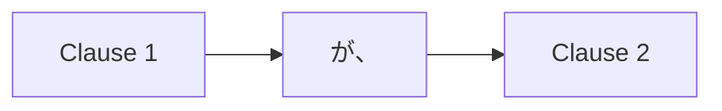

Processing keyword: ～が、～ (〜ga, 〜)
# Japanese Grammar Point: ～が、～ (〜ga, 〜)

## 1. Introduction
In this lesson, we'll explore the Japanese grammar point **～が、～ (〜ga, 〜)**. This structure is used to connect two clauses, often to express contrast or present additional, sometimes unexpected, information. Mastering this grammatical construct will help you create more complex sentences and express nuanced thoughts in Japanese.
## 2. Core Grammar Explanation
### Meaning
The particle **が** functions as a conjunction meaning **"but"**, **"however"**, or **"though"** when used to connect two clauses. It indicates that the second clause contrasts with or adds information to the first clause.
### Structure
**[Clause 1]** + **が、** + **[Clause 2]**
- **Clause 1**: Any declarative statement.
- **が、**: Conjunction particle meaning "but" or "however".
- **Clause 2**: A statement that contrasts with or adds to Clause 1.
#### Formation Diagram

### Visual Aid: Structure Table
| Component   | Role                    | Example                 |
|-------------|-------------------------|-------------------------|
| Clause 1    | Initial statement       | この本は面白い          |
| が、        | Conjunction (but/however)| が、                    |
| Clause 2    | Contrasting/additional statement | 高いです |
**Combined Sentence:** この本は面白い**が、**高いです。
**Translation:** This book is interesting, **but** it's expensive.
## 3. Comparative Analysis
Let's compare **が** with other conjunctions that mean "but":
- **でも**: Used at the beginning of the second sentence; more casual.
  - **Example:** この本は面白いです。**でも、**高いです。
- **しかし**: Formal, often used in written language.
  - **Example:** この本は面白いです。**しかし、**高いです。
- **けど/けれども**: Similar to **が**, with slight differences in formality.
  - **Example:** この本は面白い**けど**、高いです。
**が** is inserted between clauses within a single sentence, making the transition smoother and slightly more formal than **でも** or **けど**.
## 4. Examples in Context
### Example 1: Formal Written Context
**Sentence:** 日本語は難しい**が、**とても面白いです。
**Romaji:** Nihongo wa muzukashii **ga,** totemo omoshiroi desu.
**Translation:** Japanese is difficult, **but** it's very interesting.
### Example 2: Polite Conversation
**Sentence:** すみません**が、**塩を取ってください。
**Romaji:** Sumimasen **ga,** shio o totte kudasai.
**Translation:** Excuse me, **but** please pass the salt.
### Example 3: Expressing Contrast
**Sentence:** 映画を見たい**が、**時間がありません。
**Romaji:** Eiga o mitai **ga,** jikan ga arimasen.
**Translation:** I want to watch a movie, **but** I don't have time.
### Example 4: Adding Unexpected Information
**Sentence:** 彼は若い**が、**経験があります。
**Romaji:** Kare wa wakai **ga,** keiken ga arimasu.
**Translation:** He is young, **but** he has experience.
### Example 5: Casual Spoken Context
**Sentence:** 天気はいい**が、**寒いです。
**Romaji:** Tenki wa ii **ga,** samui desu.
**Translation:** The weather is nice, **but** it's cold.
## 5. Cultural Notes
### Cultural Relevance
In Japanese communication, indirectness and politeness are highly valued. Using **が** allows the speaker to present contrasting information without sounding abrupt or impolite. It softens the statement and respects the listener's feelings.
### Levels of Politeness and Formality
- **が、** is considered polite and is suitable for both formal and semi-formal situations.
- It’s less casual than **けど**, making it appropriate in professional settings or when speaking with superiors.
### Idiomatic Expressions
- **申し訳ありませんが、** (Mōshiwake arimasen ga,): "I'm sorry, but..."
- **残念ですが、** (Zannen desu ga,): "It's unfortunate, but..."
These expressions are often used to politely introduce bad news or decline an offer.
## 6. Common Mistakes and Tips
### Error Analysis
**Mistake 1:** Confusing **が** (subject marker) with **が、** (conjunction)
- **Subject Marker Example:** 私**が**行きます。 (I will go.)
- **Conjunction Example:** 行きたい**が、**忙しいです。 (I want to go, **but** I'm busy.)
**Tip:** When **が** is followed by a comma or used between two clauses, it functions as a conjunction.
**Mistake 2:** Overusing **が、** in casual speech
- In casual conversations, **けど** or **けれど** might be more appropriate.
- **Example:** 映画を見たい**けど、**お金がない。
### Learning Strategies
- **Practice Connecting Clauses:** Write sentences using **が、** to connect contrasting ideas.
- **Role-Playing:** Engage in dialogues where you need to politely decline or present contrasting information.
- **Listening Exercises:** Listen to formal speeches or news reports to hear how **が、** is naturally used.
## 7. Summary and Review
### Key Takeaways
- **が、** is used as a conjunction meaning "but" or "however".
- It connects two clauses, with the second clause contrasting with or adding to the first.
- It is polite and suitable for formal situations.
- Be mindful of the context to choose the appropriate conjunction (**が、**, **でも**, **けど**).
### Quick Recap Quiz
1. What does **が、** mean when connecting two clauses?
2. Is **が、** more formal or casual compared to **けど**?
3. Rewrite the following sentences into one using **が、**:
   - **Sentence 1:** 明日は休みです。
   - **Sentence 2:** 私は仕事をします。
### Answers
1. It means "but" or "however", connecting two contrasting clauses.
2. More formal.
3. 明日は休みです**が、**私は仕事をします。

---
By understanding and practicing the use of **～が、～ (〜ga, 〜)**, you'll enhance your ability to express complex thoughts politely and effectively in Japanese.

---

© [Hanabira.org](https://hanabira.org)
