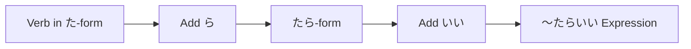

Processing keyword: ～たらいい (〜tara ii)
# Japanese Grammar Point: ～たらいい (〜tara ii)

## 1. Introduction
The expression **～たらいい (〜tara ii)** is a versatile Japanese grammar point used to offer advice, make suggestions, or express hopes and wishes. It translates to phrases like "It would be good if..." or "You should...". This structure allows speakers to provide recommendations politely and indirectly, aligning with Japanese cultural norms of subtlety in communication.

---
## 2. Core Grammar Explanation
### Meaning and Usage
- **Giving Advice or Suggestions**: Proposing an action that someone should take.
- **Expressing Wishes or Hopes**: Conveying a desire for a situation to occur.
### Formation
To construct sentences with **～たらいい**, follow these steps:
1. **Convert the verb to its past tense (た-form)**.
2. **Add ら** to form the conditional (たら-form).
3. **Attach いい** to complete the expression.
#### Structure
| Component            | Formation                 | Example with 見る (to see) |
|----------------------|---------------------------|----------------------------|
| Verb (た-form)        | 見た                      | 見た                        |
| + ら (たら-form)     | 見たら                    | 見たら                      |
| + いい               | 見たらいい                | 見たらいい                  |
#### Example
- **映画を見たらいい。**
  - *Eiga o mitara ii.*
  - You should watch a movie.
### Visual Diagram

---
## 3. Comparative Analysis
### ～たらいい vs. ～ばいい
Both expressions are used to give advice or make suggestions, but they differ slightly in form.
- **～たらいい**: Uses the past tense (た-form) + ら.
  - Example: 行ったらいい (It would be good if you go.)
- **～ばいい**: Uses the conditional form (ば-form).
  - Example: 行けばいい (You should go.)
**Nuance**: Both are generally interchangeable, but ～たらいい is often considered more conversational, while ～ばいい can sound a bit more formal or written.
---
## 4. Examples in Context
### Giving Advice
1. **日本語を練習したらいいですよ。**
   - *Nihongo o renshuu shitara ii desu yo.*
   - You should practice Japanese.
2. **疲れているなら、早く寝たらいい。**
   - *Tsukarete irunara, hayaku netara ii.*
   - If you're tired, you should go to bed early.
### Making Suggestions
1. **このレストランに行ったらいいんじゃない？**
   - *Kono resutoran ni ittara iin janai?*
   - Why don't we go to this restaurant?
2. **時間があるとき、美術館を訪ねたらいいと思います。**
   - *Jikan ga aru toki, bijutsukan o tazunetara ii to omoimasu.*
   - When you have time, I think you should visit the art museum.
### Expressing Wishes
1. **雨が止んだらいいのに。**
   - *Ame ga yandara ii noni.*
   - I wish it would stop raining.
2. **試験に合格したらいいな。**
   - *Shiken ni goukaku shitara ii na.*
   - I hope I pass the exam.
### Asking for Advice
1. **どのパソコンを買ったらいいですか。**
   - *Dono pasokon o kattara ii desu ka.*
   - Which computer should I buy?
2. **次は何をしたらいい？**
   - *Tsugi wa nani o shitara ii?*
   - What should I do next?
---
## 5. Cultural Notes
### Politeness and Social Norms
In Japanese culture, indirect communication is valued to maintain harmony and show respect. Using **～たらいい** softens suggestions, making them sound less forceful and more considerate.
### Levels of Formality
- **Casual Speech**: Often used among friends or peers without additional polite forms.
  - Example: **遊びに来たらいいよ。**
    - *Asobi ni kitara ii yo.*
    - You should come over.
- **Formal Speech**: Adding polite endings like です or ます increases formality.
  - Example: **先生に相談したらいいですよ。**
    - *Sensei ni soudan shitara ii desu yo.*
    - You should consult your teacher.
### Idiomatic Expressions
- **～たらどう？**
  - A casual way to suggest something, similar to "How about...?"
  - Example: **一緒に行ったらどう？**
    - *Issho ni ittara dou?*
    - How about going together?
---
## 6. Common Mistakes and Tips
### Error Analysis
- **Forgetting to Use the Past Tense (た-form)**:
  Incorrect: **食べらいい。**
  Correct: **食べたらいい。**
  
  *Remember to convert the verb to its past tense before adding ら.*
- **Confusing with ～たい (want to)**:
  **～たらいい** is used for suggestions, not expressing personal desires.
  Incorrect: **映画を見たらいいです。** (when meaning "I want to watch a movie.")
  Correct: **映画を見たいです。**
### Learning Strategies
- **Practice Conditional Forms**: Familiarize yourself with the たら-form by conjugating various verbs.
- **Use Mnemonics**: Think of **～たらいい** as "If (action), it would be good."
---
## 7. Summary and Review
### Key Takeaways
- **～たらいい** is used to give polite advice, make suggestions, or express wishes.
- Formed by adding **ら** to the past tense of a verb (た-form) and then adding **いい**.
- Reflects the Japanese cultural preference for indirect and polite communication.
### Quick Recap Quiz
1. **Convert to ～たらいい form**: 食べる (to eat)
   **Answer**: 食べたらいい
2. **Translate to English**: 早く起きたらいいですよ。
   **Answer**: You should wake up early.
3. **Identify the mistake**: 試験に合格するらいい。
   **Answer**: The verb should be in past tense before adding ら. Correct form: 試験に合格したらいい。
---
By understanding and practicing **～たらいい**, you can offer suggestions and express wishes naturally and politely in Japanese conversations.

---

© [Hanabira.org](https://hanabira.org)
