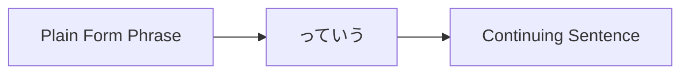
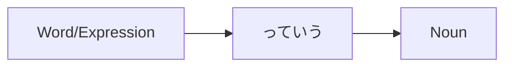

Processing keyword: ～っていう (〜tte iu)
# Japanese Grammar Point: ～っていう (〜tte iu)

## 1. Introduction
The expression **～っていう** (pronounced *tte iu*) is a versatile and commonly used grammar point in Japanese. It often appears in casual conversations and can serve multiple functions, such as quoting someone, defining or naming something, or emphasizing a topic. Understanding how to use **～っていう** will enhance your ability to engage in natural, everyday Japanese conversations.

---
## 2. Core Grammar Explanation
### Meaning
**～っていう** is used to:
- **Quote** what someone said or thought.
- **Refer** to something called or named a certain way.
- **Emphasize** or clarify a topic or concept.
### Structure
The basic structures involving **～っていう** are:
1. **Quoting Speech or Thoughts**
   ```
   [Phrase in plain form] + っていう
   ```
2. **Defining or Naming**
   ```
   [Word/Expression] + っていう + [Noun]
   ```
3. **Emphasizing a Topic**
   ```
   [Noun/Topic] + っていう + [Noun/Concept]
   ```
### Formation Diagram
#### 1. Quoting Speech or Thoughts

#### 2. Defining or Naming

---
## 3. Comparative Analysis
**～っていう** vs **～という**
- **～という** is the formal counterpart of **～っていう**.
- **～っていう** is more commonly used in **casual speech**.
  
| Expression      | Formality | Usage                         |
|-----------------|-----------|-------------------------------|
| ～っていう       | Casual    | Spoken language, informal     |
| ～という         | Formal    | Written language, formal      |
---
## 4. Examples in Context
### 1. Quoting Speech or Thoughts
- **Casual Speech**
  - **Japanese:** 明日、雨が降るっていう。
  - **Romaji:** Ashita, ame ga furu tte iu.
  - **English:** "They say it will rain tomorrow."
- **Casual Speech**
  - **Japanese:** 彼は行かないっていう。
  - **Romaji:** Kare wa ikanai tte iu.
  - **English:** "He says he won't go."
### 2. Defining or Naming
- **Introducing a Name**
  - **Japanese:** これは抹茶っていうお茶です。
  - **Romaji:** Kore wa matcha tte iu ocha desu.
  - **English:** "This is tea called matcha."
- **Explaining a Term**
  - **Japanese:** 漫画っていうのは日本のコミックです。
  - **Romaji:** Manga tte iu no wa Nihon no komikku desu.
  - **English:** "What we call 'manga' are Japanese comics."
### 3. Emphasizing a Topic
- **Highlighting a Concept**
  - **Japanese:** 愛っていうのは難しいね。
  - **Romaji:** Ai tte iu no wa muzukashii ne.
  - **English:** "Love is difficult, isn't it?"
- **Discussing an Idea**
  - **Japanese:** 時間っていうものは大切だ。
  - **Romaji:** Jikan tte iu mono wa taisetsu da.
  - **English:** "Time is important."
---
## 5. Cultural Notes
### Cultural Relevance
In Japanese culture, indirect communication is often valued. Using **～っていう** allows speakers to:
- Softly introduce opinions or thoughts.
- Quote others without asserting the information as absolute truth.
- Add a layer of humility or politeness by avoiding direct statements.
### Idiomatic Expressions
- **っていうか (tte iu ka)**: Used to correct oneself or rephrase.
  - **Example:**
    - **Japanese:** 彼は、っていうか、彼女も来ます。
    - **Romaji:** Kare wa, tte iu ka, kanojo mo kimasu.
    - **English:** "He will, or rather, she will also come."
---
## 6. Common Mistakes and Tips
### Error Analysis
- **Overusing in Formal Writing**
  - *Mistake:* Using **～っていう** in formal essays or official documents.
  - *Correction:* Use **～という** instead.
- **Misplacing the Phrase**
  - *Mistake:* Incorrectly positioning **～っていう** in the sentence.
  - *Correction:* Ensure it directly follows the word or phrase it modifies.
### Learning Strategies
- **Mnemonic Device**
  - Think of **～っていう** as the casual "they say" or "called" in English.
  
- **Practice Transformation**
  - Convert sentences from **～という** to **～っていう** to get comfortable with formality levels.
---
## 7. Summary and Review
### Key Takeaways
- **～っていう** is a casual expression used to quote, define, or emphasize.
- It is the informal counterpart of **～という**.
- Commonly used in speech, not suitable for formal writing.
### Quick Recap Quiz
1. **How do you use ～っていう to introduce the name of something?**
   - *Answer:* `[Name/Word] + っていう + [Noun]`
2. **Convert the following formal sentence into casual speech using ～っていう:**
   
   **Formal:** これは寿司という料理です。
   
   - *Answer:* これは寿司っていう料理です。
3. **Is ～っていう appropriate in formal writing?**
   - *Answer:* No, use ～という instead in formal contexts.
---
By understanding and practicing **～っていう**, you'll be able to express quotations, definitions, and emphasis naturally in everyday Japanese conversations.


---

© [Hanabira.org](https://hanabira.org)
