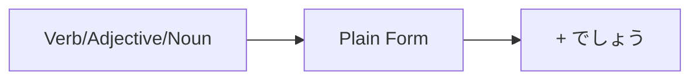

Processing keyword: ～でしょう (〜deshou)
# Japanese Grammar Point: ～でしょう (〜deshou)

## 1. Introduction
The grammar point **～でしょう** (〜deshou) is a versatile expression in Japanese used to indicate probability, conjecture, or to seek confirmation. It often translates to "probably," "I think," or "isn't it?" in English. Understanding how to use **～でしょう** correctly will enhance your ability to express uncertainty, make predictions, and confirm information in both formal and informal contexts.

---
## 2. Core Grammar Explanation
### Meaning
- **Expressing Probability or Conjecture:** Indicates that something is likely or probably true.
- **Seeking Confirmation:** Used at the end of a sentence to ask for agreement or confirmation, similar to "right?" or "isn't it?" in English.
### Structure
#### Formation
The formation of **～でしょう** depends on the type of word it follows:
| **Word Type**     | **Plain Form**                | **+ でしょう**                         |
|-------------------|-------------------------------|---------------------------------------|
| Verb              | 食べる (taberu) - to eat      | 食べる **でしょう** (taberu deshou)    |
| い-adjective      | 高い (takai) - expensive      | 高い **でしょう** (takai deshou)       |
| な-adjective      | 便利 **だ** (benri **da**) - convenient | 便利 **でしょう** (benri deshou)   |
| Noun              | 学生 **だ** (gakusei **da**) - student     | 学生 **でしょう** (gakusei deshou) |
- **Note:** For **な-adjectives** and **nouns**, the copula **だ** is often dropped in formal speech.
---
### Visual Aid: Formation Diagram

---
## 3. Comparative Analysis
### ～でしょう vs. ～かもしれません
|                    | **～でしょう**                         | **～かもしれません**                    |
|--------------------|---------------------------------------|--------------------------------------|
| **Meaning**        | Probably; I think                    | Might; may                          |
| **Certainty Level**| Higher likelihood                    | Lower likelihood                    |
| **Example**        | 雨が降る**でしょう**。 (It will probably rain.) | 雨が降る**かもしれません**。 (It might rain.) |
- **Key Difference:** **～でしょう** expresses a higher degree of certainty compared to **～かもしれません**.
---
## 4. Examples in Context
### Formal Speech
1. **明日は寒くなるでしょう。**
   - *Ashita wa samuku naru deshou.*
   - "It will probably get cold tomorrow."
2. **彼は今忙しいでしょうか。**
   - *Kare wa ima isogashii deshou ka.*
   - "Do you think he is busy now?"
### Informal Speech
1. **あの映画は面白いだろう。**
   - *Ano eiga wa omoshiroi darou.*
   - "That movie is probably interesting."
2. **疲れたでしょう？**
   - *Tsukareta deshou?*
   - "You're tired, aren't you?"
### Seeking Confirmation
1. **これはあなたの本でしょう？**
   - *Kore wa anata no hon deshou?*
   - "This is your book, isn't it?"
2. **彼女は日本に行くでしょうね。**
   - *Kanojo wa Nihon ni iku deshou ne.*
   - "She's going to Japan, right?"
### Written Context
1. **技術はさらに進歩するでしょう。**
   - *Gijutsu wa sara ni shinpo suru deshou.*
   - "Technology will probably advance further."
---
## 5. Cultural Notes
### Politeness and Formality
- **～でしょう** is more polite and formal compared to its casual counterpart **～だろう**.
- It is commonly used in formal conversations, news reports, weather forecasts, and polite daily interactions.
- In writing, **～でしょう** adds a level of formality and is preferred over **～だろう**.
### Idiomatic Expressions
- **でしょうがない / しょうがない**
  - Means "can't be helped" or "it is inevitable."
  - Example: **待つしかないでしょうがない。**
    - *Matsu shika nai deshou ga nai.*
    - "We have no choice but to wait."
---
## 6. Common Mistakes and Tips
### Common Mistakes
1. **Using the Wrong Level of Formality**
   - Mixing **～でしょう** (formal) with casual speech.
   - **Tip:** Use **～だろう** in informal contexts with friends or family.
2. **Confusing with ～と思います (to omoimasu)**
   - **～と思います** means "I think," expressing personal opinion.
   - **Tip:** Remember that **～でしょう** often implies conjecture based on some evidence or expectation.
### Learning Strategies
- **Mnemonic Device:** Think of **でしょう** as "Deshou = Definitely shows uncertainty."
- **Practice:** Create sentences about future events using **～でしょう** to get comfortable with expressing probability.
---
## 7. Summary and Review
### Key Takeaways
- **～でしょう** is used to express probability, conjecture, or to seek confirmation.
- It adds politeness and formality to your speech.
- Distinguish between **～でしょう** (formal) and **～だろう** (informal).
- Remember the differences between **～でしょう** and **～かもしれません** in terms of certainty.
### Quick Recap Quiz
1. **How do you express "It might rain tomorrow" using **～でしょう**?  
   A) 明日は雨が降るでしょう。  
   B) 明日は雨が降るかもしれません。
2. **Which is more formal, ～でしょう or ～だろう?**
3. **Translate to Japanese using **～でしょう**: "He is probably a teacher."
---
**Answers:**
1. **A) 明日は雨が降るでしょう。**
2. **～でしょう** is more formal.
3. **彼は先生でしょう。**  
   *Kare wa sensei deshou.*

---

© [Hanabira.org](https://hanabira.org)
