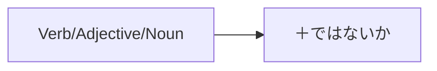

Processing keyword: ～ではないか (〜de wa nai ka)
# Japanese Grammar Point: ～ではないか (〜de wa nai ka)

## 1. Introduction
The expression **～ではないか (〜de wa nai ka)** is a versatile grammatical structure in Japanese used to:
- **Make suggestions or proposals**
- **Express strong opinions or assertions**
- **Seek agreement or confirmation**
It often translates to phrases like "Let's...", "Isn't it...", or "Don't you think..." in English. Understanding this grammar point allows you to express yourself more persuasively and engage others in conversation.

---
## 2. Core Grammar Explanation
### Meaning and Usage
**～ではないか** is used to:
1. **Suggest an Action**: Proposing something to others in an assertive yet polite manner.
   - *"Let's..."*
2. **Express an Opinion**: Stating your view strongly, expecting agreement.
   - *"Isn't it..." / "Don't you think..."*
3. **Emphasize a Statement**: Highlighting or stressing a point.
   - *"Surely..." / "Indeed..."*
### Formation
The formation varies slightly depending on whether you're using a verb, adjective, or noun.
#### Structure
| Part of Speech   | Formation                              |
|------------------|----------------------------------------|
| **Verb**         | **Verb [dictionary form]** + ではないか   |
| **い-Adjective** | **Adjective** + ではないか                |
| **な-Adjective** | **Adjective** + ではないか                |
| **Noun**         | **Noun** + ではないか                    |
#### Formation Diagram

### Examples
1. **Verb**
   - 食べる **ではないか**
   - *Taberu de wa nai ka*
   - "Let's eat, shall we?"
2. **い-Adjective**
   - 速い **ではないか**
   - *Hayai de wa nai ka*
   - "Isn't it fast?"
3. **な-Adjective**
   - 簡単 **ではないか**
   - *Kantan de wa nai ka*
   - "Isn't it simple?"
4. **Noun**
   - 彼 **ではないか**
   - *Kare de wa nai ka*
   - "Isn't that him?"
---
## 3. Comparative Analysis
### Similar Grammar Points
| Grammar Point       | Usage                           | Formality   |
|---------------------|---------------------------------|-------------|
| **～じゃないか**    | Casual form of **～ではないか** | Informal    |
| **～ましょう**      | "Let's..." for suggestions      | Neutral     |
| **～と思う**        | "I think..." for opinions       | Neutral     |
### Differences
- **～ではないか vs. ～じゃないか**
  - **～ではないか**: Formal, used in written language or formal speeches.
  - **～じゃないか**: Informal, common in everyday conversation.
- **～ではないか vs. ～ましょう**
  - **～ではないか**: More persuasive, seeking agreement.
  - **～ましょう**: Polite suggestion without strong persuasion.
---
## 4. Examples in Context
### Sentence Examples
#### Suggestion (Formal)
1. **新しいプロジェクトを始めるではないか。**
   - *Atarashii purojekuto o hajimeru de wa nai ka.*
   - "Let's start a new project."
#### Opinion/Assertion
2. **彼の意見は正しいではないか。**
   - *Kare no iken wa tadashii de wa nai ka.*
   - "Isn't his opinion correct?"
3. **これは重大な問題ではないか。**
   - *Kore wa jūdai na mondai de wa nai ka.*
   - "Isn't this a serious problem?"
#### Seeking Agreement
4. **みんなで協力すれば、成功できるではないか。**
   - *Minna de kyōryoku sureba, seikō dekiru de wa nai ka.*
   - "If we all cooperate, we can succeed, don't you think?"
#### Emphasizing a Statement
5. **時間が足りないではないか。**
   - *Jikan ga tarinai de wa nai ka.*
   - "Surely, we don't have enough time."
### Formal vs. Informal Usage
- **Formal**
  - **政治家の演説**: *国民の声を聞くべきではないか。*
    - "Shouldn't we listen to the voice of the people?"
- **Informal**
  - **友人との会話**: *今日は早く帰ろうじゃないか。*
    - "Let's head home early today, shall we?"
---
## 5. Cultural Notes
### Cultural Relevance
- **Formality in Language**: Japanese places great importance on the level of politeness and formality. Using **～ではないか** shows respect and suits formal settings like speeches, debates, or academic discussions.
### Levels of Politeness
- **Formal (～ではないか)**
  - Used in official communications, public speaking, literature.
  - Conveys seriousness and formality.
- **Informal (～じゃないか)**
  - Common among friends, family, peers.
  - Conveys a casual tone.
### Idiomatic Expressions
- **言うまでもないではないか**
  - *Iu made mo nai de wa nai ka*
  - "It goes without saying, doesn't it?"
---
## 6. Common Mistakes and Tips
### Common Mistakes
1. **Using the Wrong Level of Formality**
   - Mixing **～ではないか** in casual conversations where **～じゃないか** is appropriate.
2. **Incorrect Conjugation**
   - Misplacing **ではないか** or attaching it to the wrong verb form.
### Error Analysis
- **Incorrect**: 食べますではないか。
  - *Incorrect attachment to the polite verb form.*
- **Correct**: 食べるではないか。
  - *Attach **ではないか** to the dictionary form.*
### Learning Strategies
- **Mnemonic Device**
  - **"Think Formal = De wa nai ka"**
- **Practice Switching Formality**
  - Convert sentences between **～ではないか** and **～じゃないか** to become comfortable with both forms.
---
## 7. Summary and Review
### Key Takeaways
- **Usage**: **～ではないか** is used for making suggestions, expressing strong opinions, or seeking agreement in a formal context.
- **Formation**: Attach **ではないか** to the dictionary form of verbs, adjectives, or nouns.
- **Formality Matters**: Choose between **～ではないか** (formal) and **～じゃないか** (informal) based on the context.
### Quick Recap Quiz
1. **How do you say "Isn't it interesting?" using ～ではないか?**
   - **Answer**: 面白いではないか。
2. **Convert to formal:** *行こうじゃないか。*
   - **Answer**: 行こうではないか。
3. **What is the informal equivalent of ～ではないか?**
   - **Answer**: ～じゃないか
---
By mastering **～ではないか**, you'll enhance your ability to communicate formally and persuasively in Japanese. Keep practicing, and don't hesitate to use this structure in appropriate contexts!

---

© [Hanabira.org](https://hanabira.org)
