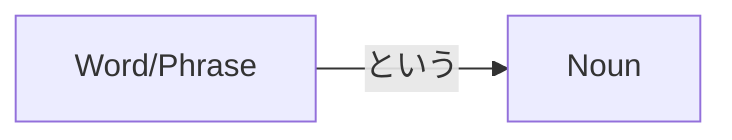

Processing keyword: ～という (〜to iu) Noun
# Japanese Grammar Point: ～という (〜to iu) Noun

## 1. Introduction
The grammar point **～という (〜to iu)** is a fundamental structure in Japanese that is used to define or describe a noun by specifying what it is called. It translates to **"called," "named,"** or **"that is called"** in English. This construction is particularly useful when introducing new concepts, items, or when specifying exactly which person or thing you're referring to.

---
## 2. Core Grammar Explanation
### Meaning
- **～という Noun**: A noun **called** ~; a noun **named** ~; a noun **that is called** ~
This structure allows the speaker to provide the name or title of a noun, effectively introducing or specifying it.
### Structure
The basic structure of this grammar point is:
```
[Word/Phrase] + という + Noun
```
- **[Word/Phrase]**: The name or title you want to apply to the noun.
- **という**: Connective phrase meaning **"called"** or **"named."**
- **Noun**: The noun being defined or described.
### Formation Diagram

### Detailed Explanation
- **という** is derived from the verb **言う (いう)** which means **"to say."**
- When attached to a word or phrase, it creates a modifier that means **"called"** or **"named."**
- This structure is used to:
  - Introduce something unfamiliar to the listener.
  - Specify or clarify which noun you're talking about.
  - Give the title or name of something.
### Visual Aid: Structure Breakdown
| Component         | Function                      | Example              |
|-------------------|-------------------------------|----------------------|
| **Word/Phrase**   | Name or title                 | スシ (Sushi)         |
| **という**        | "Called"/"Named" connector    | という               |
| **Noun**          | The thing being described     | 食べ物 (Food)        |
| **Full Sentence** | Complete idea                 | スシという食べ物     |
| **Translation**   |                               | A food called sushi. |
---
## 3. Comparative Analysis
### Similar Grammar Points
#### **～と呼ばれる (〜とよばれる)**
- **Meaning**: "Called" or "known as"
- **Usage**: More formal; often used in written language or formal speeches.
- **Example**:
  - 東京は日本の首都と呼ばれる都市です。
    - *Tōkyō wa Nihon no shuto to yobareru toshi desu.*
    - Tokyo is a city called the capital of Japan.
#### **～っていう**
- **Meaning**: Casual form of **という**, used in spoken language.
- **Usage**: Informal conversations among friends or peers.
- **Example**:
  - スシっていう食べ物を知ってる？
    - *Sushi tte iu tabemono o shitteru?*
    - Do you know a food called sushi?
### Nuances
- **という** is neutral and can be used in both formal and informal contexts.
- **～と呼ばれる** is more formal and often used to introduce definitions or official titles.
- **～っていう** is casual and commonly used in everyday speech.
---
## 4. Examples in Context
### Sentence Examples
#### **Example 1: Introducing a New Term**
- **Japanese**: これは **ラーメン** という食べ物です。
- **Romaji**: Kore wa **rāmen** to iu tabemono desu.
- **English**: This is a food called **ramen**.
#### **Example 2: Specifying a Person**
- **Japanese**: **田中さん** という人が訪ねてきました。
- **Romaji**: **Tanaka-san** to iu hito ga tazunete kimashita.
- **English**: A person named **Mr. Tanaka** came to visit.
#### **Example 3: Describing a Place**
- **Japanese**: 京都には **金閣寺** というお寺があります。
- **Romaji**: Kyōto ni wa **Kinkaku-ji** to iu otera ga arimasu.
- **English**: There is a temple called **Kinkaku-ji** in Kyoto.
#### **Example 4: Talking About a Book**
- **Japanese**: **「星の王子さま」** という本を読みました。
- **Romaji**: **"Hoshi no Ōjisama"** to iu hon o yomimashita.
- **English**: I read a book called **"The Little Prince."**
#### **Example 5: Casual Conversation**
- **Japanese**: 明日、 **花火大会** というイベントに行くよ。
- **Romaji**: Ashita, **hanabi taikai** to iu ibento ni iku yo.
- **English**: I'm going to an event called **a fireworks festival** tomorrow.
---
## 5. Cultural Notes
### Cultural Relevance
- **Clarity in Communication**: In Japanese culture, it's important to communicate clearly and provide context, especially when introducing unfamiliar terms.
- **Politeness**: Using **という** shows consideration by explaining or specifying, which aligns with the Japanese value of being polite and mindful of the listener's knowledge.
### Levels of Politeness and Formality
- The base structure **という** is neutral.
- Politeness is adjusted by the verb endings and particles used in the sentence.
  - Casual: だ (da), する (suru)
  - Polite: です (desu), します (shimasu)
### Idiomatic Expressions
#### **名は体を表す (なはたいをあらわす)**
- **Meaning**: "The name represents the body" or "Names and nature do often agree."
- **Usage**: Highlights the importance of names reflecting the true nature of something.
#### **「猫」という動物**
- Often used in educational contexts to define or teach about a subject.
  - **Example**: **猫という動物はとてもかわいいです。**
    - *The animal called a cat is very cute.*
---
## 6. Common Mistakes and Tips
### Error Analysis
#### **Mistake 1: Omitting the Noun**
- **Incorrect**: これは **スシという** 。
  - Missing the noun after **という**.
- **Correct**: これは **スシという食べ物** です。
#### **Mistake 2: Misplacing the Structure**
- **Incorrect**: **というスシ食べ物**。
  - The **という** should come after **スシ**.
- **Correct**: **スシという食べ物**。
#### **Mistake 3: Using **と** Instead of **という**
- **Incorrect**: **スシと食べ物**。
- **Correct**: **スシという食べ物**。
### Learning Strategies
#### **Tip 1: Think of **という** as "Called"**
- When you see **という**, mentally replace it with "called" to understand the sentence.
#### **Tip 2: Practice with Familiar Words**
- Create sentences using **という** with names you're familiar with.
  - **Example**: **ポケモンというゲーム** (A game called Pokémon)
#### **Tip 3: Use Flashcards**
- Write sentences using **という** to reinforce the structure.
---
## 7. Summary and Review
### Key Takeaways
- **～という** is used to define or describe a noun by its name or title.
- Structure: **[Word/Phrase] + という + Noun**
- It translates to "a noun **called** ~" or "a noun **named** ~."
- Useful for introducing new concepts or specifying particular nouns.
### Quick Recap Quiz
1. **How would you say "A song called 'Sakura'" in Japanese?**
   - **Answer**: **「さくら」という歌**
2. **Fill in the blank: 彼は _____ という会社で働いています。 (He works at a company called 'ABC Corp.')**
   - **Answer**: **「ABCコーポレーション」**
3. **True or False: The structure **という** can be used to convey hearsay or things you've heard.**
   - **Answer**: **False** (That's the function of **～そうです** or **～らしい**.)
---
By understanding and practicing the **～という** structure, you'll be able to introduce and describe things more naturally in Japanese, enhancing both your speaking and comprehension skills. Remember to pay attention to the placement of **という** and ensure that you're including both the name/title and the noun it's describing.


---

© [Hanabira.org](https://hanabira.org)
