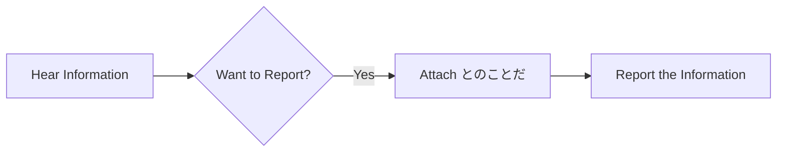

Processing keyword: ～とのことだ (〜to no koto da)
# Japanese Grammar Point: ～とのことだ (〜to no koto da)

## 1. Introduction
The grammar point ～とのことだ (〜to no koto da) is used in Japanese to relay information that has been heard from someone else. It is often used to report hearsay or convey messages indirectly, making it a valuable construct in both formal and informal communication.

---
## 2. Core Grammar Explanation
### Meaning
- **～とのことだ** is used to **report information** that you have heard from a **specific source**.
- It translates roughly to **"I've heard that..."** or **"It is said that..."**.
### Structure
The structure involves attaching **とのことだ** to the **plain form** of a verb, adjective, or noun clause.
### Formation Diagram
| **Clause Type**       | **Formation**                   |
|-----------------------|---------------------------------|
| **Verb (Plain Form)** | **Verb** + とのことだ           |
| **い-Adjective**      | **い-Adj** + とのことだ         |
| **な-Adjective**      | **な-Adj** + とのことだ         |
| **Noun**              | **Noun** + とのことだ           |
### Breakdown
- **との**: Particle と (quoting particle) + の (possessive particle)
- **こと**: Matter, thing
- **だ**: Copula (to be)
### Detailed Explanation
- **とのことだ** combines **と** (indicating quotes or reported speech) with **のことだ**, emphasizing the matter or content of what was said.
- It is often used when the speaker wants to convey information without asserting it as a fact, showing a level of detachment or formality.
### Visual Aid: Usage Flowchart

---
## 3. Comparative Analysis
### ～そうだ vs. ～とのことだ
|               | **～そうだ**                   | **～とのことだ**                   |
|---------------|-------------------------------|------------------------------------|
| **Usage**     | Hearsay & Conjecture          | Hearsay from a specific source     |
| **Formality** | Can be informal               | More formal                        |
| **Nuance**    | May imply uncertainty         | Conveys information heard directly |
- **Example**:  
  - ～そうだ: 雨が降るそうだ。(*I hear it might rain.*)
  - ～とのことだ: 部長は遅れるとのことだ。(*I've been informed that the manager will be late.*)
---
## 4. Examples in Context
### Example Sentences
1. **Formal - Business Setting**
   - 彼は来月転勤するとのことです。
     - *I've heard that he will be transferred next month.*
2. **Informal Conversation**
   - 山田さんは元気だとのことだよ。
     - *I heard that Yamada-san is doing well.*
3. **Written Communication**
   - お客様からお電話があり、少し遅れるとのことでした。
     - *There was a call from the customer; they said they'll be a little late.*
4. **Reporting News**
   - 新しいプロジェクトが始まるとのことだ。
     - *It's said that a new project will start.*
5. **Third-Party Information**
   - 天気予報によると、明日は雪になるとのことだ。
     - *According to the weather forecast, it is said that it will snow tomorrow.*
---
## 5. Cultural Notes
### Cultural Relevance
- **Politeness and Formality**: Using **～とのことだ** adds a layer of formality and detachment, which is suitable in business settings or formal communication.
- **Indirectness**: Reflects the Japanese communication style of indirectness, showing respect and politeness.
### Idiomatic Expressions
- **お疲れ様とのことです**: *He/She says thank you for your hard work.*
- **よろしくとのことだ**: *He/She sends their regards.*
---
## 6. Common Mistakes and Tips
### Error Analysis
- **Using ～とのことだ in Casual Contexts**: Overusing in informal situations can sound overly formal or distant.
  - **Tip**: In casual conversations, consider using **～って** or **～だそうだ** instead.
- **Confusion with ～ということだ**
  - **Difference**:
    - **～ということだ** can mean hearsay or conclusion.
    - **～とのことだ** is strictly for reporting information heard.
### Learning Strategies
- **Mnemonic Device**: Think of **との** as "with" the content (**のこと**) of what was said (**と**).
- **Practice**: Create sentences reporting different types of information to get comfortable with the structure.
---
## 7. Summary and Review
### Key Takeaways
- **～とのことだ** is used to report information heard from a specific source.
- Adds formality and is suitable for formal written and spoken communication.
- Should be used appropriately to match the level of formality in the context.
### Quick Recap Quiz
1. **What is the primary use of ～とのことだ?**
   - a) To express one's own intentions.
   - b) To report hearsay from a specific source.
   - c) To make conjectures about the future.
2. **Which is more formal, ～そうだ or ～とのことだ?**
3. **Fill in the blank**: 田中さんは今日休む_____。
   - (*Hint*: Use ～とのことだ to report that Tanaka-san will be absent today.)
### Answers:
1. **b) To report hearsay from a specific source.**
2. **～とのことだ is more formal.**
3. **田中さんは今日休むとのことだ。**
---
By understanding and appropriately using **～とのことだ**, you can effectively communicate reported information in a manner that is both polite and culturally appropriate in Japanese.

---

© [Hanabira.org](https://hanabira.org)
