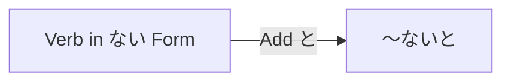

Processing keyword: ～ないと (〜nai to)
# Japanese Grammar Point: ～ないと (〜nai to)

## 1. Introduction
The grammar point **～ないと (〜nai to)** is a colloquial expression used in Japanese to indicate obligation or necessity. It conveys the meaning of "have to do something" or "must do something" and is commonly used in spoken Japanese.

---
## 2. Core Grammar Explanation
### Meaning
**～ないと** expresses a sense of duty or necessity to perform an action. It can be translated as:
- "I have to ~"
- "I must ~"
- "I need to ~"
### Structure
The structure involves attaching **と** to the plain negative form of a verb (ない form):
```
Verb (ない form) + と
```
### Formation Diagram
| Verb Dictionary Form | Verb ない Form | ＋ と | Meaning              |
|----------------------|----------------|------|----------------------|
| 行く (iku)           | 行かない       | 行かないと  | I have to go        |
| 食べる (taberu)      | 食べない       | 食べないと  | I have to eat       |
| 勉強する (benkyou suru)| 勉強しない   | 勉強しないと| I have to study     |
### Visual Aid: Formation Chart

---
## 3. Comparative Analysis
### ～なければならない (nakereba naranai)
**Meaning**: Must do ~; have to ~
- **Usage**: More formal expression of obligation.
- **Comparison**: ～ないと is more casual and often used in spoken language, whereas ～なければならない is formal and used in written or formal contexts.
**Example**:
- 行かなければならない。(I must go.) – Formal
- 行かないと。(I have to go.) – Casual
### ～なくちゃ (nakucha) / ～なきゃ (nakya)
**Meaning**: Must do ~; have to ~
- **Usage**: Very casual, often used in informal spoken Japanese.
- **Comparison**: Similar level of casualness as ～ないと, but with slight differences in regional usage and personal preference.
**Example**:
- 行かなくちゃ。(I have to go.)
- 行かなきゃ。(I have to go.)
---
## 4. Examples in Context
### Example Sentences
1. **早く寝ないと。**
   *I have to go to bed early.*
2. **宿題をしないと。**
   *I have to do my homework.*
3. **買い物に行かないといけない。**
   *I have to go shopping.*
4. **今日中にこのレポートを終わらせないと。**
   *I have to finish this report by today.*
5. **もう帰らないと。**
   *I have to go home now.*
### Variations in Formality
- **Informal Spoken**: 行かないと。(I have to go.)
- **Formal Spoken/Written**: 行かなければなりません。(I must go.)
---
## 5. Cultural Notes
### Levels of Politeness
In Japanese culture, the level of politeness and formality is essential in communication. Using **～ないと** indicates a casual and friendly tone, suitable among friends, family, or peers.
- **Use with Caution**: Avoid using **～ないと** in formal situations, business settings, or with superiors. Instead, opt for **～なければなりません** for formal contexts.
### Idiomatic Expressions
- **忘れないと。**
  *I must not forget.*
- **連絡しないと。**
  *I have to get in touch.*
---
## 6. Common Mistakes and Tips
### Common Mistakes
1. **Using ～ないと in Formal Situations**
   - Incorrect: 明日の会議に行かないと。(I have to go to tomorrow's meeting.)
   - Correction: 明日の会議に行かなければなりません。
   *Tip*: Use formal expressions like **～なければなりません** in formal contexts.
2. **Confusing with Negative Conditionals**
   - Misinterpretation: 行かないといけない。(I have to go.) vs. 行かないと、困る。(If I don't go, it will be a problem.)
   *Tip*: Pay attention to the context to distinguish obligation from conditional sentences.
### Learning Strategies
- **Mnemonic Device**: Think of **～ないと** as "If I don't ~, (there will be consequences)" shortened to "I have to ~".
- **Practice**: Create sentences about daily tasks using **～ないと** to become familiar with its casual usage.
---
## 7. Summary and Review
### Key Takeaways
- **～ないと** is a casual expression meaning "have to ~" or "must ~".
- Formed by adding **と** to the negative form of a verb.
- Used in informal spoken Japanese among friends and peers.
- More formal alternatives include **～なければならない**.
### Quick Recap Quiz
1. **How do you say "I have to study" using ～ないと?**
   a) 勉強しないと。
   b) 勉強したいと。
   c) 勉強しなければ。
2. **Which form is more formal?**
   a) 行かないと。
   b) 行かなければなりません。
3. **True or False:** ～ないと should be used in business emails.
### Answers
1. **a) 勉強しないと。**
2. **b) 行かなければなりません。**
3. **False**


---

© [Hanabira.org](https://hanabira.org)
