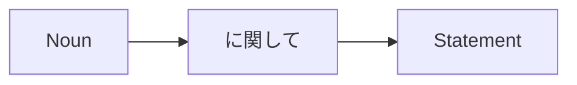

Processing keyword: ～に関して (〜ni kanshite)
# Japanese Grammar Point: ～に関して (〜ni kanshite)

## 1. Introduction
In this lesson, we'll explore the Japanese grammar point **～に関して (〜ni kanshite)**, which is used to express "concerning," "regarding," or "about" a particular topic. This expression is commonly found in formal contexts and is essential for discussing topics in detail.

---
## 2. Core Grammar Explanation
### Meaning
**～に関して** is used to indicate that the following statement is related to the preceding noun. It is similar to saying "regarding..." or "concerning..." in English.
### Structure
The basic structure is:
- **Noun + に関して**
- **Noun + に関する + Noun**
### Formation Diagram
| **Structure**                   | **Usage**                                  |
| ------------------------------- | ------------------------------------------ |
| **Noun + に関して**             | Used to introduce a topic of discussion    |
| **Noun + に関する + Noun**      | Modifies a noun related to the topic       |
### Visual Aid: Structure Breakdown

---
## 3. Comparative Analysis
### ～に関して vs. ～について
Both **～に関して** and **～について** mean "about" or "regarding," but there are subtle differences:
| **Grammar Point**         | **Formality** | **Usage**                                        |
| ------------------------- | ------------- | ------------------------------------------------ |
| **～に関して**           | Formal        | Used in formal contexts, such as presentations   |
| **～について**           | Neutral       | Used in everyday conversation                    |
---
## 4. Examples in Context
### Formal Context
1. **環境問題に関して研究しています。**
   *Kankyō mondai ni kanshite kenkyū shite imasu.*
   "I am researching concerning environmental issues."
2. **その件に関して、後ほどご連絡いたします。**
   *Sono ken ni kanshite, nochihodo go-renraku itashimasu.*
   "Regarding that matter, I will contact you later."
### Modifying a Noun
3. **健康に関する本を読みました。**
   *Kenkō ni kan suru hon o yomimashita.*
   "I read a book about health."
### Written Language
4. **新製品に関してのお知らせがあります。**
   *Shinseihin ni kanshite no o-shirase ga arimasu.*
   "We have an announcement regarding the new product."
### Spoken Language (Formal)
5. **この問題に関して、ご意見をお願いします。**
   *Kono mondai ni kanshite, go-iken o onegai shimasu.*
   "Please give us your opinion concerning this issue."
---
## 5. Cultural Notes
### Formality and Politeness
- **～に関して** is more formal than **～について**.
- Often used in business, academic, or official settings.
- Using **～に関して** shows respect and professionalism.
### Idiomatic Expressions
- **～に関するところでは**
  *~ni kan suru tokoro de wa*
  "As far as (someone) knows regarding..."
---
## 6. Common Mistakes and Tips
### Common Mistakes
1. **Using ～に関して in Casual Conversations**
   - Incorrect: *昨日の映画に関して面白かった。*
     *Kinō no eiga ni kanshite omoshirokatta.*
   - Correct: *昨日の映画について面白かった。*
     *Kinō no eiga ni tsuite omoshirokatta.*
   - **Tip:** Use **～について** in casual contexts.
2. **Forgetting to Use the Correct Form**
   - Incorrect: *環境に関して本*
   - Correct: *環境に関する本*
   - **Tip:** When modifying a noun, use **に関する**.
### Learning Strategies
- **Mnemonic:** Think of **関 (connection)** in **関して** as "connecting" to a topic in a formal way.
- **Practice:** Create sentences related to formal topics you are interested in.
---
## 7. Summary and Review
### Key Takeaways
- **～に関して** is used to express "regarding" or "concerning" in formal contexts.
- It is more formal than **～について**.
- Use **に関する** when modifying a noun.
### Quick Recap Quiz
1. How do you say "I have a question regarding the schedule" using **～に関して**?
   **Answer:** *スケジュールに関して質問があります。*
2. Which is more formal: **～に関して** or **～について**?
   **Answer:** **～に関して** is more formal.
3. Fill in the blank: *経済______論文を読みました。* (I read a paper about economics.)
   **Answer:** *経済**に関する**論文を読みました。*
---
By understanding and practicing **～に関して**, you can effectively express topics in formal Japanese and enhance your communication skills in professional settings.

---

© [Hanabira.org](https://hanabira.org)
