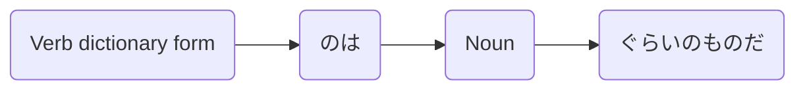

Processing keyword: ～のは Noun ぐらいのものだ (〜no wa 〜 gurai no mono da)
# Japanese Grammar Point: ～のは Noun ぐらいのものだ (〜no wa 〜 gurai no mono da)

## 1. Introduction
In this lesson, we'll explore the grammar point **～のは Noun ぐらいのものだ**. This structure is used to express that only a particular person or thing meets a certain condition or is capable of something. It's a way to emphasize uniqueness or exclusivity in a statement.
## 2. Core Grammar Explanation
### Detailed Explanation
The grammar pattern **～のは Noun ぐらいのものだ** is used to convey that something is limited exclusively to a particular noun. It emphasizes that *only* that noun fits the description or can perform the action specified.
### Meaning
- **English Equivalent**: "Only (Noun) can...", "It's only (Noun) that...", "No one but (Noun)..."
- **Function**: Emphasizes exclusivity or uniqueness.
### Structure
#### Formation Diagram
| Component          | Role                                   |
|--------------------|----------------------------------------|
| **Verb (dictionary form) のは** | Nominalizes the verb (turns action into a noun) |
| **Noun**           | The exclusive entity/person            |
| **ぐらいのものだ**        | "is about the only one/thing"                |
#### Visual Aid

## 3. Comparative Analysis
This grammar point is similar to **～しかない**, which also indicates "only" or "nothing but". However, **～のは Noun ぐらいのものだ** has a stronger emphasis on exclusivity and is often used to highlight that something is exceptional or rare.
| Grammar Point                | Usage                             | Example                                   |
|------------------------------|-----------------------------------|-------------------------------------------|
| ～のは Noun ぐらいのものだ         | Only Noun can...                 | 彼ができるのはプロぐらいのものだ。             |
| ～しかない                    | There is nothing but...           | ここには水しかない。                       |
## 4. Examples in Context
### Sentence Examples
1. **彼が問題を解けるのは天才ぐらいのものだ。**
   - *Kare ga mondai o tokeru no wa tensai gurai no mono da.*
   - "Only a genius like him can solve the problem."
2. **こんな難しい曲を演奏できるのは彼女ぐらいのものだ。**
   - *Konna muzukashii kyoku o ensō dekiru no wa kanojo gurai no mono da.*
   - "She's about the only one who can perform such a difficult piece."
3. **私が信用できるのは君ぐらいのものだ。**
   - *Watashi ga shin'yō dekiru no wa kimi gurai no mono da.*
   - "You're the only one I can trust."
4. **この料理を作れるのはプロのシェフぐらいのものだ。**
   - *Kono ryōri o tsukureru no wa puro no shefu gurai no mono da.*
   - "Only a professional chef can make this dish."
5. **彼と対等に戦えるのは彼女ぐらいのものだろう。**
   - *Kare to taitō ni tatakaeru no wa kanojo gurai no mono darō.*
   - "She's probably the only one who can fight him on equal terms."
## 5. Cultural Notes
### Cultural Relevance
In Japanese culture, expressing modesty and recognizing others' uniqueness is valued. Using this grammar point can highlight respect for someone's exceptional abilities or the rarity of a situation.
### Idiomatic Expressions
- **それができるのは彼ぐらいのものだ。**
  - An idiomatic way to acknowledge someone's unique capability.
## 6. Common Mistakes and Tips
### Error Analysis
- **Mistake**: Omitting **のは**, which is crucial for nominalizing the verb and linking it to the noun.
  - *Incorrect*: 彼ができるぐらいのものだ。
  - *Correct*: 彼ができる**のは**プロぐらいのものだ。
- **Mistake**: Using **だけ** instead of **ぐらいのものだ**, which changes the nuance.
  - *Incorrect*: 彼女だけがこの仕事をできる。
  - *Correct*: この仕事をできるのは彼女ぐらいのものだ。
### Learning Strategies
- **Mnemonic Device**: Think of **ぐらい** as "about" and **のものだ** as "the only one", so together they emphasize "only about (Noun) is the one".
- **Practice**: Create your own sentences by identifying unique abilities or situations.
## 7. Summary and Review
### Key Takeaways
- **～のは Noun ぐらいのものだ** emphasizes that only a specific noun fits the condition.
- It highlights uniqueness or exclusivity.
- Proper structure is crucial: Verb (dictionary form) **のは** Noun **ぐらいのものだ**.
### Quick Recap Quiz
1. What does **ぐらいのものだ** imply in this grammar structure?
2. Transform the following sentence using **～のは Noun ぐらいのものだ**:
   - "Only professionals can understand this code."
   - *Answer*: このコードを理解できるのはプロフェッショナルぐらいのものだ。
3. Identify the error in this sentence:
   - 彼が解決できるのは彼女ぐらいものだ。
   - *Answer*: Missing **の** after **ぐらい**. Correct sentence: 彼が解決できるのは彼女ぐらい**の**ものだ。

---
By understanding and practicing this grammar point, you'll be able to express exclusivity and highlight uniqueness effectively in Japanese.

---

© [Hanabira.org](https://hanabira.org)
