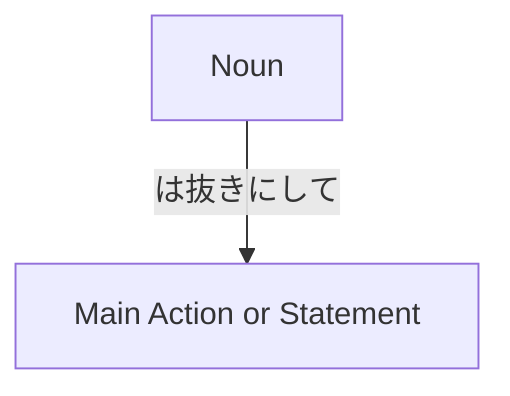

Processing keyword: ～は抜きにして (〜wa nuki ni shite)
# Japanese Grammar Point: ～は抜きにして (〜wa nuki ni shite)

## 1. Introduction
In this lesson, we'll explore the Japanese grammar point **～は抜きにして (〜wa nuki ni shite)**, which translates to "**setting aside...**", "**without...**", or "**leaving out...**" in English. This expression is useful when you want to proceed without considering a particular element or when you want to focus on what's important by excluding certain factors from the discussion.

---
## 2. Core Grammar Explanation
### Meaning
- **～は抜きにして**: *Setting aside...*, *without...*, *leaving out...*
This phrase is used to exclude a particular topic or factor from consideration, allowing the conversation or action to focus on other aspects.
### Structure
#### Formation Diagram

#### Formation
- **Noun + は抜きにして + Main Action/Statement**
**Components:**
1. **Noun**: The element you want to set aside or exclude.
2. **は (wa)**: Topic marker particle.
3. **抜きにして (nuki ni shite)**: Phrase meaning "leaving out" or "without".
### Detailed Explanation
The phrase **～は抜きにして** is constructed by taking a noun (the topic to exclude) and attaching **は抜きにして**. This effectively tells the listener that you're setting that noun aside and proceeding without considering it.
- **Example Breakdown:**
  - **冗談は抜きにして、仕事に取り掛かりましょう。**
    - *Jōdan wa nuki ni shite, shigoto ni torikakarimashō.*
    - "Putting jokes aside, let's get to work."
  - **冗談 (jōdan)**: Joke(s)
  - **は (wa)**: Topic marker
  - **抜きにして (nuki ni shite)**: Setting aside
  - **仕事に取り掛かりましょう (shigoto ni torikakarimashō)**: Let's get to work
---
## 3. Comparative Analysis
### Similar Grammar Points
| Grammar Point         | Meaning                      | Nuance Difference                                                                                             |
| --------------------- | ---------------------------- | ------------------------------------------------------------------------------------------------------------- |
| **～を抜きにして**     | Without..., excluding...      | Uses **を** instead of **は**, slightly changes the focus to the direct object being excluded.                  |
| **～はさておき**       | Putting aside..., aside from... | Suggests postponing discussion about the topic; often used to divert the conversation to another subject.     |
| **～を除いて**         | Except for..., excluding...    | More formal; directly states the exclusion of something from a group or list.                                 |
---
## 4. Examples in Context
### Sentence Examples
#### **1. Formal**
- **結果は抜きにして、努力を評価します。**
  - *Kekka wa nuki ni shite, doryoku o hyōka shimasu.*
  - "Setting aside the results, we will evaluate the effort."
#### **2. Informal**
- **冗談は抜きにして、本題に入ろう。**
  - *Jōdan wa nuki ni shite, hondai ni hairō.*
  - "Jokes aside, let's get to the main topic."
#### **3. Spoken**
- **予算は抜きにして、いいアイデアを出してください。**
  - *Yosan wa nuki ni shite, ii aidea o dashite kudasai.*
  - "Forget about the budget; please come up with good ideas."
#### **4. Written**
- **感情は抜きにして、客観的に判断するべきだ。**
  - *Kanjō wa nuki ni shite, kyakkan-teki ni handan subeki da.*
  - "Emotions aside, we should judge objectively."
---
## 5. Cultural Notes
### Cultural Relevance
In Japanese culture, maintaining harmony and focusing on collective goals over individual feelings is important. Using **～は抜きにして** allows speakers to gently set aside personal matters or less relevant topics to focus on what's important, which aligns with the cultural emphasis on group cohesion and efficiency.
### Politeness and Formality
- The expression is versatile and can be used in both formal and informal settings.
- Adjust the politeness level by modifying the verbs and phrases that follow **～は抜きにして**.
### Idiomatic Expressions
- **冗談は抜きにして** (*Jōdan wa nuki ni shite*): "Jokes aside"
- **個人的な意見は抜きにして** (*Kojin-teki na iken wa nuki ni shite*): "Putting personal opinions aside"
These idiomatic uses are common in both business and casual conversations.
---
## 6. Common Mistakes and Tips
### Error Analysis
1. **Using the Wrong Particle**
   - **Incorrect:** *冗談を抜きにして、本当のことを話しましょう。*
   - **Correct:** *冗談は抜きにして、本当のことを話しましょう。*
   - **Explanation:** Use **は** as the topic marker in this expression, not **を**.
2. **Misplacing **抜きにして**** in the Sentence
   - **Incorrect:** *抜きにして冗談は、本題に入りましょう。*
   - **Correct:** *冗談は抜きにして、本題に入りましょう。*
   - **Explanation:** The noun followed by **は抜きにして** should come before the main clause.
### Learning Strategies
- **Remember the Structure:**
  - Think of **[Noun] + は抜きにして + Action** as a fixed pattern.
- **Association Technique:**
  - Associate **抜き (nuki)** with "抜く (nuku)" meaning "to extract" or "to remove". This can help you remember that you're "removing" the topic from consideration.
---
## 7. Summary and Review
### Key Takeaways
- **～は抜きにして** is used to exclude a topic from consideration, meaning "setting aside..." or "without...".
- It is formed by attaching **は抜きにして** to a noun.
- Commonly used to focus on the main issue by excluding less relevant topics.
- Remember to use the particle **は** with this expression.
### Quick Recap Quiz
1. **Translate to Japanese:** "Putting personal feelings aside, let's discuss the facts."
   - **Answer:** *個人的な感情は抜きにして、事実を話し合いましょう。*
2. **Fill in the Blank:** *予測_____抜きにして、現状を見つめる必要がある。*
   - **Answer:** *予測**は**抜きにして*
3. **True or False:** The particle **を** is used with **抜きにして** in this grammar point.
   - **Answer:** False (*は* is used, not *を*.)
---
By understanding and practicing **～は抜きにして**, you can effectively steer conversations to focus on what's important, a useful skill in both professional and personal contexts.

---

© [Hanabira.org](https://hanabira.org)
