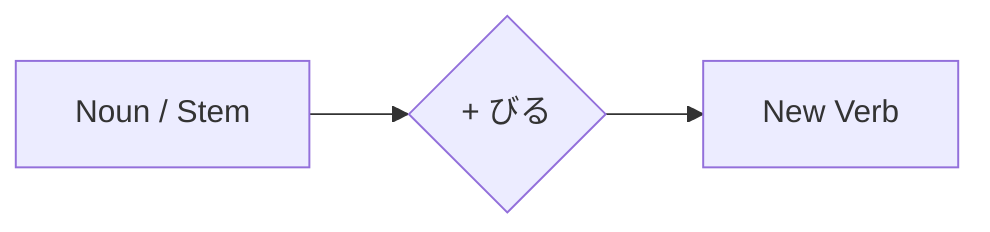

Processing keyword: ～びる (〜biru)
# Japanese Grammar Point: ～びる (〜biru)

## 1. Introduction
In this lesson, we'll delve into the Japanese grammar suffix **～びる (〜biru)**. This suffix is used to form verbs that express "to appear like" or "to have the characteristics of" something. Understanding **～びる** will help you describe subtle nuances in appearance and behavior in Japanese.

---
## 2. Core Grammar Explanation
### Meaning
The suffix **～びる** attaches to certain nouns or stems to form verbs that mean:
- **To look like** (appearance)
- **To seem like**
- **To act like**
- **To take on the characteristics of**
### Structure
The basic structure is:
```
[ Noun / Stem ] + びる → Verb meaning "to appear/seem like [Noun]"
```
### Formation Diagram

### Examples of Formation
| Noun/Stem        | + びる | New Verb       | Meaning                         |
|------------------|--------|----------------|---------------------------------|
| 大人 (おとな)     | + びる | 大人びる        | To act grown-up/mature          |
| 古い (ふるい)     | + びる | 古びる          | To look old                     |
| 悪 (わる)        | + びれる| 悪びれる        | To feel guilty/ashamed          |
| 錆 (さび)        | + びる | 錆びる          | To rust                         |
| 色 (いろ)        | + びる | 色びる          | To become colorful              |
| 子ども (こども)  | + びる | 子どもびる      | To act childish                 |
*Note*: The use of **～びる** is not productive with all nouns; it is mainly used with certain words.
---
## 3. Comparative Analysis
### Comparison with Similar Grammar Points
#### **～らしい (〜rashii)**
- **Meaning**: Appears to be, seems like (based on evidence)
- **Usage**: Attached to nouns to form adjectives
- **Example**: *彼は大人らしい。* (He seems mature.)
#### **～っぽい (〜ppoi)**
- **Meaning**: -ish, -like (indicates resemblance)
- **Usage**: Attached to nouns, adjectives, or verbs to form adjectives
- **Example**: *子どもっぽい態度。* (Childish attitude.)
### Key Differences
- **～びる** creates verbs; **～らしい** and **～っぽい** create adjectives.
- **～びる** implies taking on characteristics, often behaviorally.
- **～っぽい** may carry a negative connotation, suggesting something is characteristic in an excessive or undesirable way.
---
## 4. Examples in Context
Let's look at how **～びる** is used in sentences across different contexts.
### Formal Context
1. **その寺は歴史が古く、趣きが古びています。**
   *That temple has a long history and looks archaic.*
2. **彼の文章は大人びているので、感心しました。**
   *I was impressed because his writing is mature.*
### Informal Context
3. **うちの子、最近急に大人びてきたね。**
   *Our child has suddenly started acting grown-up lately, huh?*
4. **彼女は年の割に悪びれないね。**
   *She doesn’t feel guilty despite her age, does she?*
### Spoken Language
5. **この服、ちょっと古びてない？**
   *Isn't this clothing a bit outdated?*
6. **弟が子どもびたことを言って困る。**
   *My younger brother says childish things, and it bothers me.*
### Written Language
7. **鉄が錆びてしまったため、交換が必要です。**
   *Since the iron has rusted, replacement is necessary.*
8. **彼の振る舞いは年齢以上に大人びていた。**
   *His behavior was more mature than his age.*
---
## 5. Cultural Notes
### Understanding Nuances
- Using **～びる** can subtly express that someone or something is taking on characteristics that may be unexpected or not inherent.
- For example, a child acting like an adult (**大人びる**) might be seen as impressive or, depending on context, precocious.
### Politeness and Formality
- **～びる** itself is neutral in politeness.
- The formality is determined by the surrounding language, such as verb endings and honorifics.
### Idiomatic Expressions
- **悪びれずに**: *Unashamedly; without remorse.*
  *Example*: **彼は悪びれずに約束を破った。**
  *He broke the promise without any shame.*
- **古びた**: *Worn-out; antiquated.*
  *Often used to describe things that are old but may have nostalgic value.*
---
## 6. Common Mistakes and Tips
### Common Mistakes
1. **Overgeneralization**
   - **Mistake**: Trying to attach **～びる** to any noun.
   - **Correction**: Only use **～びる** with nouns it commonly pairs with.
2. **Confusion with Similar Suffixes**
   - Mixing up **～びる** with **～ぽい** or **～らしい**.
   - **Tip**: Remember that **～びる** forms verbs, while **～ぽい** and **～らしい** form adjectives.
3. **Incorrect Conjugation**
   - Forgetting to conjugate **～びる** correctly in different tenses.
   - **Example**: **古びます** (polite present), **古びた** (plain past), **古びて** (te-form).
### Tips
- **Learn Set Phrases**: Since **～びる** is not widely productive, focus on memorizing common verbs that use it.
  
- **Verb Conjugation Practice**:
  | Verb         | Polite Present | Plain Past | Te-form |
  |--------------|----------------|------------|---------|
  | 大人びる     | 大人びます      | 大人びた    | 大人びて |
  | 古びる       | 古びます        | 古びた      | 古びて   |
  | 錆びる       | 錆びます        | 錆びた      | 錆びて   |
- **Contextual Clues**: Pay attention to the context to choose the correct grammar pattern. If describing appearance or behavior resembling something, **～びる** may be appropriate.
---
## 7. Summary and Review
### Key Takeaways
- **～びる** is a suffix used to form verbs meaning "to appear like" or "to have qualities of" something.
- It attaches to specific nouns or stems.
- Common **～びる** verbs include **大人びる**, **古びる**, **錆びる**.
  
### Quick Recap Quiz
1. **Fill in the blank**: "To act grown-up" in Japanese is **大人______**.
   
   **Answer**: **びる** (大人**びる**)
2. **True or False**: **～びる** can be added to any noun to create a verb.
   
   **Answer**: **False**
3. **Choose the correct usage**: Which sentence correctly uses **～びる**?
   
   A) *彼は学生びる。*
   B) *彼女は大人びた話し方をする。*
   C) *この料理は辛びる。*
   
   **Answer**: **B)** *彼女は大人びた話し方をする。*
---
By understanding and practicing **～びる**, you'll be able to express nuanced observations about appearances and behaviors in Japanese!


---

© [Hanabira.org](https://hanabira.org)
