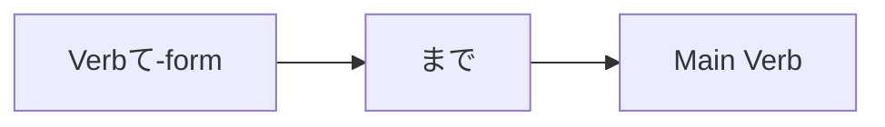

Processing keyword: ～まで～て (〜made 〜te)
# Japanese Grammar Point: ～まで～て (〜made 〜te)

## 1. Introduction
In this lesson, we will explore the Japanese grammar pattern **～まで～て (〜made 〜te)**. This construction is used to express going to great lengths or extremes to accomplish something. It often conveys a sense of overdoing or doing something excessive to achieve a particular result.

---
## 2. Core Grammar Explanation
### Meaning
The pattern **～まで～て** is used to indicate that someone does something **to the extent of** or **even to the point of** an extreme action to achieve a goal. It emphasizes the lengths one is willing to go, sometimes implying that the action is unnecessary or over the top.
**English equivalents:**
- "Go so far as to..."
- "Even to the point of..."
- "To the extent of..."
### Structure
The structure of this grammar point is:
#### **Verbて-form + まで + Verb**
| Component          | Role                                  |
|--------------------|---------------------------------------|
| **Verbて-form**     | Extreme action taken                  |
| **まで**            | Particle indicating "to the extent of" |
| **Main Verb**      | Primary action or goal                |
### Formation Diagram

---
## 3. Comparative Analysis
### Comparison with Similar Grammar Points
- **～てでも**: Indicates doing something undesirable but necessary to achieve a goal.
  - **Example**: 会えないなら、借金してでも行く。
    *If I can't meet you, I'll go even if I have to borrow money.*
- **～までも**: Expresses "to the extent of" but often used with nouns.
  - **Example**: 命までも捧げる。
    *I would dedicate even my life.*
While **～てでも** focuses on the willingness to do something undesirable, **～まで～て** emphasizes the extremes one goes to, often highlighting the excessiveness.
---
## 4. Examples in Context
### Example Sentences
1. **彼は借金してまで新車を買った。**
   *Kare wa shakkin shite made shinsha o katta.*
   - **Translation**: He went so far as to borrow money to buy a new car.
2. **彼女は嘘をついてまで彼を守った。**
   *Kanojo wa uso o tsuite made kare o mamotta.*
   - **Translation**: She protected him even to the point of telling lies.
3. **健康を害してまで働く必要はない。**
   *Kenkō o gaishite made hataraku hitsuyō wa nai.*
   - **Translation**: There's no need to work to the extent of harming your health.
4. **名誉を失ってまで成功したくない。**
   *Meiyo o ushinatte made seikō shitakunai.*
   - **Translation**: I don't want to succeed if it means losing my honor.
5. **徹夜してまでこのゲームをクリアしたい。**
   *Tetsuya shite made kono gēmu o kuria shitai.*
   - **Translation**: I want to clear this game even if I have to stay up all night.
### Contextual Usage
- **Formal Written**
  - **環境を破壊してまで経済成長を求めるべきではない。**
    *Kankyō o hakai shite made keizai seichō o motomeru beki dewa nai.*
    - We should not seek economic growth to the extent of destroying the environment.
- **Casual Spoken**
  - **徹夜してまで勉強するなんて、無理しないで。**
    *Tetsuya shite made benkyō suru nante, muri shinai de.*
    - Don't overdo it by studying to the point of pulling an all-nighter.
---
## 5. Cultural Notes
### Cultural Relevance
In Japanese culture, moderation and balance are valued. Using **～まで～て** highlights actions that go beyond normal boundaries, often viewed as excessive or unnecessary. It can carry a negative connotation, suggesting that the action might not be socially or personally advisable.
### Levels of Politeness
This grammar pattern can be used in both polite and casual conversations, but the context often dictates formality. In written and formal speech, it's used to discuss serious matters, while in casual speech, it's used to express concern or exaggeration.
### Idiomatic Expressions
- **死んでまで**
  *Shinde made*
  - **Translation**: To the point of dying.
  - **Usage**: **死んでまで守りたいものがある。**
    *There are things I want to protect even if it means dying.*
---
## 6. Common Mistakes and Tips
### Error Analysis
1. **Using Plain Form Instead of て-form**
   - **Incorrect**: 借金するまで新車を買った。
   - **Correct**: 借金してまで新車を買った。
     *Use the Verbて-form before まで.*
2. **Misplacing まで**
   - **Incorrect**: 彼はまで借金して新車を買った。
   - **Correct**: 彼は借金してまで新車を買った。
     *まで follows the Verbて-form.*
### Learning Strategies
- **Mnemonic Device**
  - Think of **Verbて-form + まで** as "doing [Verb] up to the point of..."
- **Visual Reminder**
  - Associate **まで** with a milestone or limit, emphasizing the extent reached.
---
## 7. Summary and Review
### Key Takeaways
- **～まで～て** expresses going to extreme lengths to do something.
- Structure: **Verbて-form + まで + Main Verb**
- Conveys a sense of excessiveness or unnecessary action.
### Quick Recap Quiz
1. **Fill in the blank with the correct form:**
   健康を________まで働く意味があるのか。
   - **Answer**: **害して**
2. **Translate the following sentence:**
   **彼はリスクを冒してまでそのプロジェクトに参加した。**
   - **Answer**: He participated in that project even at the risk of endangering himself.
3. **True or False:**
   The grammar pattern **～まで～て** is used to express moderate actions.
   - **Answer**: False (It expresses extreme or excessive actions.)
---
By understanding **～まで～て**, you can express the lengths to which someone is willing to go to achieve something, adding depth and nuance to your Japanese communication skills.

---

© [Hanabira.org](https://hanabira.org)
