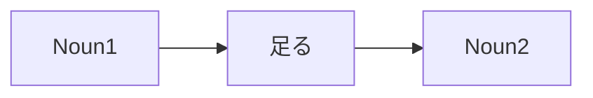

Processing keyword: ～足る Noun (〜taru～)
# Japanese Grammar Point: ～足る Noun (〜taru～)

## 1. Introduction
In this lesson, we'll explore the grammar point **～足る (〜たる)**, a formal expression used in Japanese to denote worthiness or suitability. This structure emphasizes that someone or something possesses the qualities necessary for a particular role or status.

---
## 2. Core Grammar Explanation
### Meaning
The phrase **～足る Noun** means "worthy of being ~" or "suitable for ~". It highlights that the subject has the qualities or status befitting the noun that follows.
### Structure
```plaintext
Noun1 + 足る + Noun2
```
- **Noun1**: The entity possessing the qualities.
- **足る (たる)**: An archaic verb meaning "to be worthy of" or "to be sufficient for".
- **Noun2**: The role or status being conferred.
### Formation Diagram
| Component | Function                                |
|-----------|-----------------------------------------|
| Noun1     | Subject with qualities                  |
| 足る      | Indicates worthiness/suitability         |
| Noun2     | Role or status the subject is worthy of |
---
### Visual Aid

---
## 3. Comparative Analysis
### Comparison with Similar Expressions
- **～にふさわしい Noun**
  - **Meaning**: "Noun suitable for ~", "appropriate for ~".
  - **Usage**: More common in everyday conversation.
  - **Example**: 
    - 彼はリーダーにふさわしい人物だ。  
      *He is a person suitable to be a leader.*
- **～に値する (〜にあたいする)**
  - **Meaning**: "To be worth ~", "to deserve ~".
  - **Usage**: Can be used in both formal and informal contexts.
  - **Example**: 
    - 彼の行動は尊敬に値する。  
      *His actions deserve respect.*
**Differences**:
- **～足る** is more formal and often used in written language or speeches.
- It carries a stronger connotation of inherent worthiness or qualification.
---
## 4. Examples in Context
### Example Sentences
1. **教師足る者、常に学ぶ姿勢を持つべきだ。**  
   *きょうしたるもの、つねにまなぶしせいをもつべきだ。*  
   *A person worthy of being a teacher should always have a learning attitude.*
2. **彼は信頼するに足る人物だ。**  
   *かれはしんらいするにたるじんぶつだ。*  
   *He is a person worthy of trust.*
3. **この作品は賞賛に足る出来栄えだ。**  
   *このさくひんはしょうさんにたるできばえだ。*  
   *This work is of a quality worthy of praise.*
4. **彼女はリーダー足る資質を備えている。**  
   *かのじょはリーダーたるししつをそなえている。*  
   *She possesses the qualities befitting a leader.*
5. **政治家足る者、公正であるべきだ。**  
   *せいじかたるもの、こうせいであるべきだ。*  
   *Those worthy of being politicians should be fair.*
---
### Contextual Usage
- **Formal Situations**: Used in formal speeches, writings, and discussions about roles and responsibilities.
- **Emphasizing Standards**: Highlights the high standards or qualities expected of someone in a particular role.
---
## 5. Cultural Notes
### Cultural Relevance
In Japanese culture, great emphasis is placed on fulfilling one's role with the appropriate qualities and behaviors. Using **～足る** underscores the importance of meeting societal expectations associated with certain positions.
### Levels of Politeness and Formality
- **Formal Expression**: Not commonly used in casual conversation.
- **Suitability in Writing**: Appropriate for essays, formal letters, and speeches.
### Idiomatic Expressions
- **勇気ある者足るべし**  
  *(One should be worthy of being called courageous.)*
- **紳士足る態度**  
  *(An attitude befitting a gentleman.)*
---
## 6. Common Mistakes and Tips
### Error Analysis
1. **Using in Informal Contexts**
   - **Mistake**: Using **～足る** in casual conversation can sound unnatural.
   - **Correction**: Use more common expressions like **～にふさわしい**.
   - **Example**: 
     - Casual: **彼は信頼するに足る友達だ。** (Too formal)
     - Better: **彼は信頼できる友達だ。** (He is a trustworthy friend.)
2. **Incorrect Structure**
   - **Mistake**: Misplacing **足る** or using the wrong form.
   - **Correction**: Ensure **足る** directly follows **Noun1**.
   - **Example**: 
     - Incorrect: **足る教師者、学生の模範だ。**
     - Correct: **教師足る者、学生の模範だ。**
### Learning Strategies
- **Association**: Connect **足る** with "being sufficient or worthy of" to remember its meaning.
- **Practice Formal Contexts**: Read formal Japanese texts to see how **～足る** is used.
- **Use Set Phrases**: Memorize common expressions like **信頼するに足る** to become familiar with the pattern.
---
## 7. Summary and Review
### Key Takeaways
- **～足る Noun** is a formal expression meaning "worthy of being ~" or "suitable for ~".
- **Structure**: **Noun1 + 足る + Noun2**
- Emphasizes the subject's suitability or qualifications for a role.
- Commonly used in formal writing and speeches.
- Not typically used in everyday conversation.
---
### Quick Recap Quiz
1. **Fill in the Blank**
   この作品は賞賛に ____ 出来栄えだ。  
   *(This work is of a quality worthy of praise.)*
   **Answer**: 足る
2. **True or False**
   **～足る** is commonly used in casual conversation among friends.
   **Answer**: False
3. **Choose the Correct Usage**
   Which sentence correctly uses **～足る**?
   a) 彼は学生足りる者だ。  
   b) 彼は学生足る者だ。  
   c) 彼は学生に足る者だ。
   **Answer**: b) 彼は学生足る者だ。
---
By understanding **～足る Noun**, you enhance your ability to read and comprehend formal Japanese texts and express nuanced ideas about worthiness and suitability in appropriate contexts.


---

© [Hanabira.org](https://hanabira.org)
